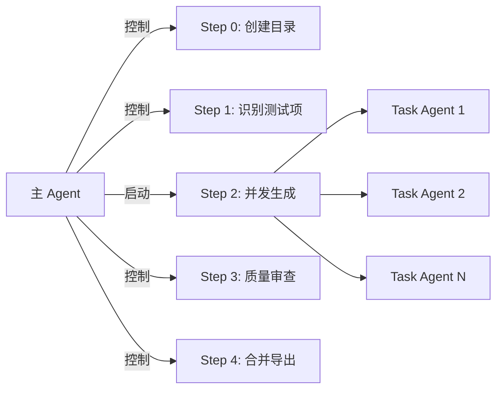
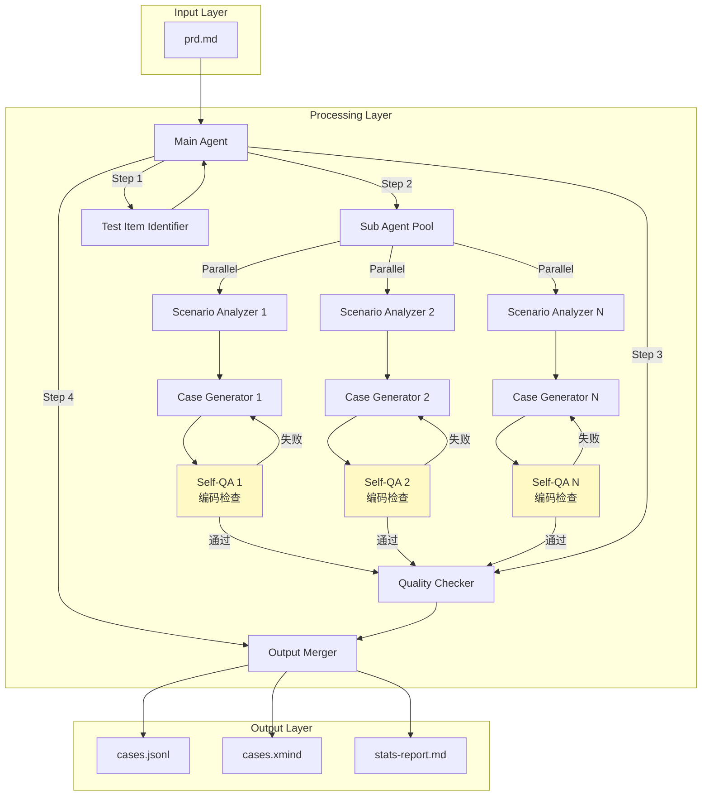
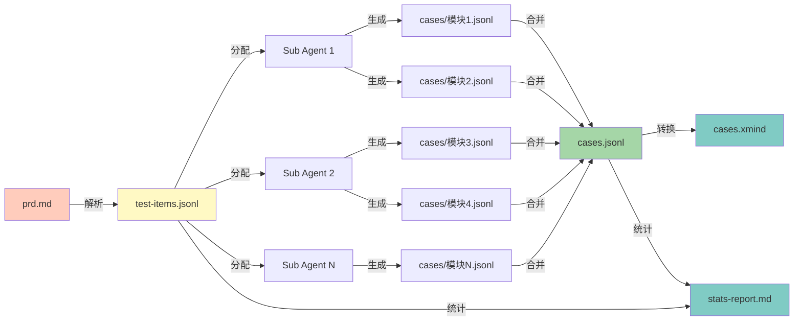
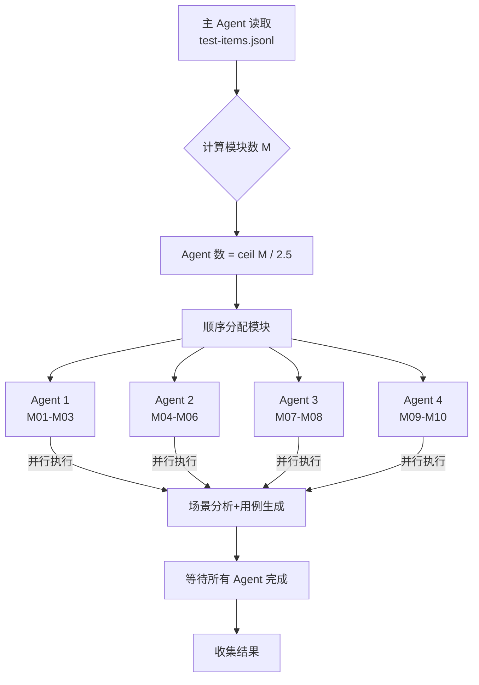
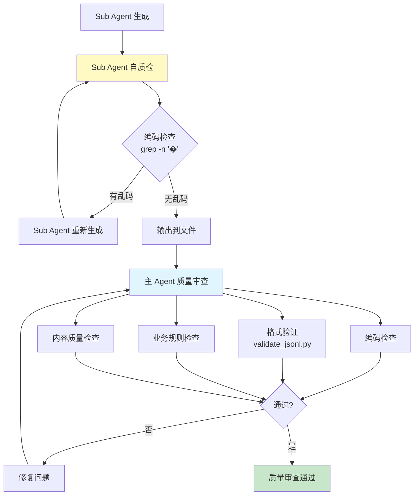

# Test Case Generator - 设计文档

> **Skill Name**: `test-case-generator`
> **Version**: 2.0 (Lightweight Test Items)
> **Last Updated**: 2025-12-10
> **Author**: Claude Code

---

## 目录

- [设计概述](#设计概述)
- [核心设计理念](#核心设计理念)
- [架构设计](#架构设计)
- [关键技术决策](#关键技术决策)
- [数据流设计](#数据流设计)
- [并发策略](#并发策略)
- [质量保证机制](#质量保证机制)
- [与其他 Skill 的集成](#与其他-skill-的集成)
- [使用示例](#使用示例)
- [设计演进](#设计演进)
- [未来规划](#未来规划)

---

## 设计概述

### 定位

**Test Case Generator** 是一个自动化测试用例生成工具，专注于从规范化的需求文档（PRD）生成结构化、高质量的测试用例体系。

### 核心价值

1. **自动化程度高**：从需求到测试用例的全流程自动化
2. **质量有保证**：内置多层质量检查机制
3. **扩展性强**：支持并发生成，可处理大规模需求
4. **输出多样**：支持 JSONL、XMind、统计报告等多种格式

### 适用场景

| 场景 | 说明 |
|-----|------|
| 新项目测试用例设计 | 根据 PRD 快速生成初版测试用例 |
| 需求变更后用例更新 | 重新生成受影响模块的用例 |
| 测试覆盖度分析 | 评估当前测试用例的覆盖情况 |
| 测试用例标准化 | 统一测试用例格式和质量标准 |

### 前置依赖

- **必需输入**：规范化的 `prd.md` 文件
- **推荐前置 Skill**：`requirement-tester`（用于需求预处理和规范化）
- **技术依赖**：Python 3.9+、jsonschema、xmind

---

## 核心设计理念

### 1. 轻量级识别 + 重量级生成

```
┌─────────────────┐         ┌──────────────────┐
│  快速识别        │   →    │  并发生成         │
│  测试项列表      │         │  完整测试用例     │
│  (轻量级)       │         │  (重量级)        │
└─────────────────┘         └──────────────────┘
     单线程                      多线程并发
     耗时: 秒级                   耗时: 分钟级
```

**设计原则**：
- ⚡ **快速获得并发基准**：Step 1 只识别测试项，不做场景分析
- 🔄 **避免重复解析**：每个模块的 prd 内容保存在 test-items.jsonl 中
- 🎯 **面向并发分配**：按模块分组，便于并发处理

**优势**：
- Step 1 完成后立即知道有多少模块，计算并发数
- Sub Agent 获得完整业务上下文（prd 内容），理解更准确
- 场景分析和用例生成可以并发执行，大幅提升效率

### 2. 模块前缀 ID 方案

```
模块 M01: M01-001, M01-002, M01-003, ...
模块 M02: M02-001, M02-002, M02-003, ...
模块 M03: M03-001, M03-002, M03-003, ...
```

**设计原则**：
- 🔢 **独立编号空间**：每个模块独立编号，从 001 开始
- 🚫 **天然无冲突**：不同模块的 ID 永不冲突
- 📦 **模块归属清晰**：ID 即表明所属模块

**对比传统方案**：

| 方案 | ID 格式 | 冲突风险 | 并发友好度 | 模块识别 |
|-----|--------|---------|-----------|---------|
| 全局递增 | TC-001, TC-002... | 高（需预分配） | 低 | 需额外字段 |
| **模块前缀** | M01-001, M02-001... | **无（天然隔离）** | **高** | **ID 即模块** |

### 3. 明确的执行控制



**设计原则**：
- 🎯 **职责清晰**：主 Agent 控制流程，Sub Agent 执行生成
- 🚫 **防止过度委托**：明确禁止主 Agent 把整个流程委托给单个 Task Agent
- ⚡ **并发仅用于生成**：只有 Step 2 使用并发，其他步骤单线程

**为什么这样设计**：
- 防止主 Agent "偷懒"，跳过关键步骤
- 确保 Step 1（测试项识别）必须执行，为并发提供基准
- 质量审查和合并导出需要全局视野，不适合并发

### 4. Sub Agent 自质检机制

```
Sub Agent 工作流：
生成用例 → 自质检 → 发现问题？
                 ↓           ↓
                 否         是
                 ↓           ↓
            输出文件    重新生成
```

**设计原则**：
- 🔍 **自我负责**：Sub Agent 对自己输出的质量负责
- ⚡ **及早发现**：在生成阶段就发现并修复问题
- 🔄 **立即修复**：发现问题立即重新生成，不留到后续

**自质检内容**：
- **编码检查**：运行 `grep -n '�'` 检查乱码字符
- **格式自查**：确认输出的 JSONL 格式正确
- **完整性检查**：确认所有分配的测试项都生成了用例

**责任边界**：
| 检查类型 | Sub Agent 职责 | Main Agent 职责 |
|---------|---------------|----------------|
| 编码检查 | ✅ 第一道防线，自查 | ✅ 第二道防线，复查 |
| 格式检查 | ✅ 基础自查 | ✅ 完整验证（Schema） |
| 业务规则 | ❌ 不检查 | ✅ 全面检查 |
| 内容质量 | ❌ 不检查 | ✅ 人工审查 |

**为什么这样设计**：
- **提高效率**：避免所有模块生成完才发现问题，减少返工
- **分布式质量**：质量检查分散到各个 Sub Agent，而非集中到最后
- **双重保险**：Sub Agent 自查 + Main Agent 复查，确保质量

---

## 架构设计

### 整体架构



### 组件职责

| 组件 | 职责 | 执行者 | 并发 |
|-----|------|--------|-----|
| **Test Item Identifier** | 从 PRD 识别测试项，评估业务价值 | Main Agent | 否 |
| **Scenario Analyzer** | 场景分析（正向/边界/异常/性能/安全） | Sub Agent | 是 |
| **Case Generator** | 生成结构化测试用例（ID/steps/priority） | Sub Agent | 是 |
| **Sub Agent Self-QA** | **Sub Agent 自质检（编码检查、格式自查）** | **Sub Agent** | **是** |
| **Quality Checker** | 编码检查、格式验证、业务规则检查 | Main Agent | 否 |
| **Output Merger** | 合并用例、导出 XMind、生成统计报告 | Main Agent | 否 |

**特别说明**：
- **Sub Agent 自质检**：每个 Sub Agent 在生成模块用例后，会立即执行自质检：
  - 运行 `grep -n '�'` 检查乱码
  - 如发现乱码，**立即重新生成**该模块文件
  - 确保输出的文件无编码问题
  - 这是质量保证的**第一道防线**

### 数据模型

#### 1. ModuleTestItems（轻量级）

```typescript
interface ModuleTestItems {
  module_id: string;           // M01, M02, M03...
  module_name: string;         // ≤15 字符
  test_items: Array<{
    item: string;              // 测试项名称
    business_value: "高" | "中" | "低";
  }>;
  prd: string;                 // 该模块的完整需求内容
}
```

**设计考虑**：
- `module_id` 用于后续用例 ID 前缀
- `prd` 字段保存模块需求，供 Sub Agent 理解业务
- `test_items` 列表包含该模块所有待测功能点

#### 2. TestCase（重量级）

```typescript
interface TestCase {
  id: string;                  // M01-001, M01-002...
  name: string;                // 主谓宾格式，以"验证"开头
  module_name: string;         // ≤15 字符
  test_item: string;           // 所属测试项
  scenario_type: string;       // 正向/边界/异常/性能/安全场景
  priority: "P1" | "P2" | "P3" | "P4" | "P5";
  test_type: string;           // 13 种测试类型之一
  is_negative: boolean;        // 是否反向用例
  preconditions: string[];     // 前置条件
  steps: Array<{
    action: string;            // 具体操作
    expected: string;          // 可验证结果
  }>;
  notes?: string;              // 备注（可选）
}
```

**设计考虑**：
- `id` 采用模块前缀，天然无冲突
- `scenario_type` 和 `is_negative` 双重标记场景类型
- `steps` 采用 action-expected 结构，便于执行和验证
- `priority` 和 `test_type` 参考 reference 文档判定

---

## 关键技术决策

### 决策 1: 为什么采用两阶段设计？

**背景**：最初考虑过一次性识别+生成，但发现存在问题：
- 无法预知工作量，难以分配并发
- 每个 Sub Agent 需要重复解析 PRD
- 场景分析和用例生成混在一起，难以优化

**决策**：分离为两阶段
1. **Stage 1（轻量级）**：快速识别测试项，评估业务价值
2. **Stage 2（重量级）**：并发执行场景分析和用例生成

**权衡**：
- ✅ 优点：并发基准明确、避免重复解析、便于进度跟踪
- ❌ 缺点：多一次文件 I/O（test-items.jsonl）
- **结论**：优点远大于缺点，多一次 I/O 可忽略

### 决策 2: 为什么使用模块前缀 ID？

**背景**：曾考虑过多种 ID 方案：

| 方案 | 示例 | 问题 |
|-----|------|-----|
| 全局递增 | TC-001, TC-002... | 并发时需预分配，容易冲突 |
| UUID | 550e8400-e29b-... | 不可读，难以排序 |
| 模块+全局序号 | M01-TC001, M02-TC001 | TC 部分需要全局协调 |
| **模块+局部序号** | **M01-001, M01-002** | **✅ 天然无冲突** |

**决策**：采用模块前缀 + 局部序号

**权衡**：
- ✅ 优点：天然无冲突、可读性强、模块归属清晰
- ⚠️ 限制：每个模块最多 999 个用例（M01-001 ~ M01-999）
- **结论**：999 个用例已足够，实际很少有单模块超过 100 个用例

### 决策 3: 为什么 test-items.jsonl 包含 prd 内容？

**背景**：最初设计只保存测试项列表，Sub Agent 需要自己读 prd.md

**问题**：
- Sub Agent 需要知道哪部分 prd 属于自己负责的模块
- 需要额外传递 prd 章节信息或让 Sub Agent 自己查找
- 增加了 Sub Agent 的复杂度

**决策**：在 test-items.jsonl 中为每个模块保存其对应的 prd 内容

**权衡**：
- ✅ 优点：Sub Agent 获得完整业务上下文、简化 Sub Agent 逻辑
- ❌ 缺点：test-items.jsonl 文件变大（包含重复的 prd 文本）
- **结论**：文件大小可接受，简化 Sub Agent 更重要

### 决策 4: 为什么并发数使用 ceil(M/2.5)？

**背景**：需要确定启动多少个 Sub Agent

**考虑因素**：
- 每个 Sub Agent 开销（内存、上下文窗口）
- 模块之间的工作量差异
- 并发过多导致资源竞争

**公式推导**：
```
理想情况：每个 Agent 处理 2-3 个模块
平均值：2.5 个模块/agent
Agent 数 = ceil(M / 2.5)

示例：
M = 5  → ceil(5/2.5) = 2 agents
M = 8  → ceil(8/2.5) = 4 agents
M = 10 → ceil(10/2.5) = 4 agents
```

**权衡**：
- ✅ 优点：简单直接、无需预估工作量、适应性强
- ⚠️ 限制：不考虑模块大小差异（假设工作量相对均匀）
- **结论**：实践中模块工作量通常相对均匀，简单公式足够

### 决策 5: 为什么使用绝对路径而非相对路径？

**背景**：原设计使用相对路径（如 `test-case-generator/references/...`）

**问题**：
- Sub Agent 的工作目录（cwd）不确定
- 相对路径依赖于当前目录，容易失败
- 调试困难，错误信息不明确

**决策**：使用绝对路径，通过占位符传递

```markdown
# agent-prompt.md 模板
{skill_dir}/references/priority-guide.md
{workspace}/test-items.jsonl

# 主 Agent 启动 Sub Agent 时替换
/absolute/path/to/test-case-generator/references/priority-guide.md
/absolute/path/to/output/test-items.jsonl
```

**权衡**：
- ✅ 优点：路径明确、不依赖 cwd、错误易定位
- ❌ 缺点：需要主 Agent 替换占位符（增加一点复杂度）
- **结论**：可靠性远比便利性重要

---

## 数据流设计

### 数据流向图



### 目录结构演进

```
初始状态：
/path/to/
└── Polaris 差旅报销中台.md          # 用户提供

Step 0 完成：
/path/to/
├── Polaris 差旅报销中台.md
└── Polaris 差旅报销中台/             # 创建 workspace
    └── (空目录)

Step 1 完成：
/path/to/
├── Polaris 差旅报销中台.md
└── Polaris 差旅报销中台/
    └── test-items.jsonl              # 生成

Step 2 完成：
/path/to/
├── Polaris 差旅报销中台.md
└── Polaris 差旅报销中台/
    ├── test-items.jsonl
    └── cases/                        # 生成
        ├── 用户登录.jsonl
        ├── 订单管理.jsonl
        ├── 支付功能.jsonl
        └── ...

Step 4 完成：
/path/to/
├── Polaris 差旅报销中台.md
└── Polaris 差旅报销中台/
    ├── test-items.jsonl
    ├── cases/                        # 中间态，可选保留
    │   └── ...
    ├── cases.jsonl                   # 合并后
    ├── cases.xmind                   # XMind 导出
    └── stats-report.md               # 统计报告
```

### 数据转换

#### 转换 1: prd.md → test-items.jsonl

```
输入（prd.md）：
## 用户登录
支持用户名、手机号、邮箱三种方式登录。
登录失败超过 5 次锁定账号 30 分钟。

## 订单管理
用户可以创建、查询、取消订单。
订单金额需要满足最低金额要求。

输出（test-items.jsonl）：
{"module_id":"M01","module_name":"用户登录","test_items":[{"item":"用户登录流程","business_value":"高"},{"item":"账号锁定机制","business_value":"高"}],"prd":"## 用户登录\n支持用户名、手机号、邮箱三种方式登录。\n登录失败超过 5 次锁定账号 30 分钟。"}
{"module_id":"M02","module_name":"订单管理","test_items":[{"item":"订单创建","business_value":"高"},{"item":"订单查询","business_value":"中"}],"prd":"## 订单管理\n用户可以创建、查询、取消订单。\n订单金额需要满足最低金额要求。"}
```

#### 转换 2: test-items.jsonl → cases/*.jsonl

```
输入（test-items.jsonl 中的一行）：
{"module_id":"M01","module_name":"用户登录","test_items":[{"item":"用户登录流程","business_value":"高"}],...}

输出（cases/用户登录.jsonl）：
{"id":"M01-001","name":"验证用户成功登录系统","module_name":"用户登录","test_item":"用户登录流程","scenario_type":"正向场景","priority":"P1",...}
{"id":"M01-002","name":"验证密码错误时登录失败","module_name":"用户登录","test_item":"用户登录流程","scenario_type":"异常场景","priority":"P3",...}
{"id":"M01-003","name":"验证连续5次错误后账号锁定","module_name":"用户登录","test_item":"用户登录流程","scenario_type":"边界场景","priority":"P3",...}
```

#### 转换 3: cases/*.jsonl → cases.jsonl

```
输入（多个模块文件）：
cases/用户登录.jsonl    (3 条用例)
cases/订单管理.jsonl    (5 条用例)
cases/支付功能.jsonl    (4 条用例)

输出（单个合并文件）：
cases.jsonl             (12 条用例，按模块排序)
```

---

## 并发策略

### 并发模型



### 分配策略

**顺序分配算法**：

```python
def allocate_modules(modules: list, agent_count: int) -> list:
    """将模块顺序分配给各 agent"""
    allocations = [[] for _ in range(agent_count)]

    for i, module in enumerate(modules):
        agent_idx = i % agent_count
        allocations[agent_idx].append(module)

    return allocations

# 示例
modules = [M01, M02, M03, M04, M05, M06, M07, M08, M09, M10]
agent_count = 4

result = [
    [M01, M05, M09],  # Agent 1
    [M02, M06, M10],  # Agent 2
    [M03, M07],       # Agent 3
    [M04, M08],       # Agent 4
]
```

**为什么不做负载均衡**？

| 方案 | 复杂度 | 准确性 | 实际效果 |
|-----|-------|--------|---------|
| 预估工作量 + 负载均衡 | 高 | 低（难以准确预估） | 边际收益小 |
| **顺序分配** | **低** | **中等** | **足够好** |

**结论**：实践中模块工作量相对均匀，顺序分配已足够。

### 并发数据隔离

```
模块 M01（Agent 1 负责）：
  输出文件: cases/用户登录.jsonl
  ID 范围: M01-001, M01-002, M01-003...

模块 M02（Agent 2 负责）：
  输出文件: cases/订单管理.jsonl
  ID 范围: M02-001, M02-002, M02-003...

特点：
✅ 输出文件独立（不同文件名）
✅ ID 空间独立（不同前缀）
✅ 无需锁、无需同步
```

### 故障处理

**如果某个 Sub Agent 失败**：

1. **检测**：主 Agent 等待所有 agent 完成，发现某个失败
2. **影响范围**：仅影响该 agent 负责的模块
3. **恢复方案**：
   - 方案 A：手动修复后重新启动该 agent
   - 方案 B：调整分配，将失败模块分给其他 agent
4. **其他模块**：不受影响，已生成的用例保留

**容错设计**：
- ✅ 模块独立性保证部分成功可用
- ✅ ID 方案保证重新生成不会冲突
- ✅ 文件独立性便于单独替换

---

## 质量保证机制

### 多层质量检查



### 质量检查清单

#### 0. Sub Agent 自质检（第一道防线）

**执行时机**：Sub Agent 生成每个模块文件后立即执行

**检查命令**：
```bash
grep -n '�' {workspace}/cases/{module_name}.jsonl
```

**检查流程**：
1. Sub Agent 生成完一个模块的用例文件（如 `cases/用户登录.jsonl`）
2. 立即运行 grep 检查该文件是否有乱码字符
3. **判断规则**：
   - ✅ **无输出** = 无乱码，该模块完成
   - ❌ **有输出** = 发现乱码，Sub Agent **立即重新生成该模块文件**
4. 重新生成后再次检查，直到无乱码
5. 继续处理下一个模块

**责任归属**：
- **Sub Agent 负责**：确保自己输出的文件无乱码
- **主 Agent 负责**：最终再次验证所有文件（双重保险）

**示例输出**：
```bash
# 有乱码的情况（Sub Agent 需要重新生成）
$ grep -n '�' cases/用户登录.jsonl
3:{"id":"M01-003","name":"验证用户�功登录",...}

# 无乱码的情况（通过，继续下一个模块）
$ grep -n '�' cases/用户登录.jsonl
$
```

**设计理念**：
- 🎯 **及早发现，及早修复**：在 Sub Agent 阶段就解决问题
- 🔄 **自我负责**：Sub Agent 对自己的输出质量负责
- 🚀 **提高效率**：避免所有模块生成后才发现问题

#### 1. 编码检查（主 Agent 复查）

```bash
grep -n '�' {workspace}/cases/*.jsonl
```

- **检测对象**：乱码字符（�）
- **执行时机**：主 Agent 在 Step 3 质量审查阶段
- **处理策略**：发现即停止，必须修复
- **备注**：这是**第二道防线**，Sub Agent 应该已经自查过

#### 2. 格式验证（自动）

```bash
python scripts/validate_jsonl.py cases/*.jsonl --strict
```

**检查项**：
- JSON 语法正确性
- Schema 符合性（字段类型、必填项）
- ID 格式（M01-001）
- ID 唯一性
- scenario_type 有效值
- steps 结构完整性

#### 3. 业务规则检查（半自动）

**检查项**：
- [ ] 测试项覆盖率 = 100%
- [ ] 每个测试项至少 1 个正向场景
- [ ] 每个测试项至少 1 个异常/边界场景
- [ ] 优先级分布合理（P1 10-20%）
- [ ] 反向用例占比 ≥15%

#### 4. 内容质量检查（手动）

**检查项**：
- [ ] 用例名称主谓宾格式，以"验证"开头
- [ ] 步骤描述具体可执行（无"正确操作"等模糊描述）
- [ ] 预期结果可验证（无"正常"等模糊描述）
- [ ] 前置条件完整明确
- [ ] test_type 与 scenario_type 匹配

### 质量阈值

| 指标 | 目标值 | 说明 |
|-----|-------|-----|
| 测试项覆盖率 | 100% | 所有测试项都有用例 |
| 场景覆盖 | ≥2 种/测试项 | 至少 1 正向 + 1 异常/边界 |
| P1 用例占比 | 10-20% | 核心功能正向场景 |
| P2 用例占比 | 25-35% | 基本功能正向场景 |
| P3 用例占比 | 20-30% | 核心功能反向场景 |
| P4 用例占比 | 15-25% | 基本功能反向场景 |
| P5 用例占比 | 5-10% | 不常用功能 |
| 反向用例占比 | ≥15% | 异常/边界场景 |
| 格式错误数 | 0 | validate_jsonl.py --strict |
| ID 冲突数 | 0 | 每个 ID 全局唯一 |
| 乱码字符数 | 0 | grep -n '�' 无输出 |

### 质量报告模板

```markdown
## 质量审查报告

**生成时间**: 2025-12-10 14:30:00
**需求名称**: Polaris 差旅报销中台

### 基本统计
- 模块数: 8
- 测试项数: 42
- 总用例数: 156

### 覆盖率
- 测试项覆盖率: 100% (42/42)
- 遗漏测试项: 无

### 场景分布
- 正向场景: 42 个 (27%)
- 边界场景: 38 个 (24%)
- 异常场景: 52 个 (33%)
- 性能场景: 12 个 (8%)
- 安全场景: 12 个 (8%)

### 优先级分布
- P1: 18 个 (12%) ✅
- P2: 47 个 (30%) ✅
- P3: 44 个 (28%) ✅
- P4: 35 个 (22%) ✅
- P5: 12 个 (8%) ✅

### 质量指标
- 反向用例占比: 18% ✅
- 格式错误: 0 ✅
- ID 冲突: 0 ✅
- 乱码字符: 0 ✅

### 结论
✅ 质量审查通过，可以导出
```

---

## 与其他 Skill 的集成

### 与 requirement-tester 的协作


**协作模式**：

| 阶段 | Skill | 输入 | 输出 | 职责 |
|-----|-------|-----|------|-----|
| 1 | requirement-tester | 原始需求 | prd.md | 需求规范化、缺陷识别、补充异常场景 |
| 2 | **test-case-generator** | prd.md | 测试用例 | 测试项识别、场景分析、用例生成 |

**为什么需要分离**？

| 职责 | requirement-tester | test-case-generator |
|-----|-------------------|-------------------|
| 需求质量 | ✅ 识别缺陷、补充场景 | ❌ 假设需求已规范 |
| 需求格式 | ✅ 转换为标准格式 | ❌ 不处理格式问题 |
| 测试项识别 | ❌ 不输出测试项 | ✅ 识别测试项 |
| 用例生成 | ❌ 不生成用例 | ✅ 生成结构化用例 |

**单一职责原则**：每个 skill 专注于一件事，并做到最好。

### 与其他 Skill 的潜在集成

#### 1. 与 code-analyzer 的集成

**场景**：测试用例驱动的代码审查

```
测试用例 → 代码审查 → 覆盖度分析
```

**可能的工作流**：
1. test-case-generator 生成测试用例
2. 开发完成代码实现
3. code-analyzer 分析代码，对比测试用例
4. 输出：哪些用例已实现、哪些缺失、代码覆盖度

#### 2. 与 test-executor（未来）的集成

**场景**：自动化测试执行

```
测试用例 → 自动化脚本 → 执行报告
```

**可能的工作流**：
1. test-case-generator 生成 cases.jsonl
2. test-executor 读取用例，转换为自动化脚本
3. 执行测试，生成报告

---

## 使用示例

### 示例 1: 基础用法

**场景**：为新项目生成测试用例

```bash
# 1. 准备需求文档
# 文件：/projects/my-app/需求文档.md

# 2. （推荐）先规范化需求
/requirement-tester /projects/my-app/需求文档.md

# 3. 生成测试用例
/test-case-generator /projects/my-app/需求文档-规范化.md

# 输出目录结构：
# /projects/my-app/需求文档-规范化/
# ├── test-items.jsonl
# ├── cases/
# ├── cases.jsonl
# ├── cases.xmind
# └── stats-report.md
```

### 示例 2: 自定义配置

**场景**：只生成特定模块的用例

```bash
# 修改 test-items.jsonl，只保留需要的模块
# 然后从 Step 2 开始执行

# 手动编辑 test-items.jsonl，只保留模块 M01, M03
{"module_id":"M01",...}
{"module_id":"M03",...}

# 重新执行 Step 2-4
# Sub Agent 只会处理 M01 和 M03
```

### 示例 3: 增量更新

**场景**：需求变更，只更新部分模块

```bash
# 1. 删除受影响模块的 cases 文件
rm cases/用户登录.jsonl

# 2. 修改 test-items.jsonl 中该模块的 prd 内容
# 更新 M01 模块的 prd 字段

# 3. 重新运行 Sub Agent 生成该模块
# 只启动一个 Sub Agent，分配 M01

# 4. 重新合并
python scripts/merge_jsonl.py cases/*.jsonl -o cases.jsonl
```

### 示例 4: 质量审查

**场景**：检查生成的用例质量

```bash
# 1. 编码检查
grep -n '�' cases/*.jsonl
# 输出为空 = 无乱码

# 2. 格式验证
cd test-case-generator
python scripts/validate_jsonl.py /path/to/output/cases/*.jsonl --strict
# ✅ 所有文件通过

# 3. 查看统计报告
cat stats-report.md
# 检查优先级分布、覆盖率等指标
```

---

## 设计演进

### v1.0: 初始版本（已废弃）

**设计**：
- 全局递增 ID（TC-001, TC-002...）
- 测试点（TestPoint）概念，包含完整场景分析
- 复杂的 ID 段预分配机制

**问题**：
- ID 冲突风险高，需要复杂的预分配逻辑
- 测试点过于重量级，识别阶段耗时长
- 难以准确预估工作量，负载均衡困难

### v2.0: 轻量级测试项 + 模块前缀 ID（当前版本）

**改进**：
1. **ID 方案重构**：全局递增 → 模块前缀（M01-001）
   - 天然无冲突
   - 取消 ID 段预分配
   - 模块归属清晰

2. **两阶段设计**：
   - Stage 1: 轻量级测试项识别（快速）
   - Stage 2: 重量级用例生成（并发）

3. **简化并发策略**：
   - 取消负载均衡
   - 简单公式：ceil(M/2.5)
   - 顺序分配模块

4. **路径处理优化**：
   - 相对路径 → 绝对路径
   - 添加 {skill_dir} 占位符
   - 明确路径替换责任

5. **执行控制强化**：
   - 明确禁止整体委托
   - 明确主 Agent 职责
   - 只有 Step 2 使用并发

### 关键里程碑

| 时间 | 版本 | 关键变更 | Commit |
|-----|------|---------|--------|
| 2025-12-08 | v1.0 | 初始实现，测试点设计 | 3891c30 |
| 2025-12-09 | v1.5 | 简化为测试项，模块前缀 ID | 4c7fae2 |
| 2025-12-09 | v1.8 | 修复路径问题，添加编码检查 | 7efbf62 |
| 2025-12-10 | v2.0 | 完整逻辑文档，路径优化 | b2885ea |

---

## 未来规划

### 短期规划（1-3 个月）

#### 1. 增强 Sub Agent 的智能度

**目标**：Sub Agent 能够更智能地分析场景

**计划**：
- 引入场景分析模板库
- 基于需求关键词自动选择模板
- 支持自定义场景分析规则

#### 2. 支持增量更新

**目标**：需求变更时只更新受影响的模块

**计划**：
- 需求 diff 检测
- 自动识别受影响模块
- 只重新生成变更模块的用例

#### 3. 优化质量检查

**目标**：更准确地发现质量问题

**计划**：
- 增加语义相似度检查（避免重复用例）
- 增加逻辑冲突检查（前后矛盾）
- 增加覆盖度热力图（可视化缺失）

### 中期规划（3-6 个月）

#### 1. 支持多种输出格式

**目标**：对接更多测试管理工具

**计划**：
- 支持 TestRail 格式
- 支持 JIRA Test Case 格式
- 支持 Excel 格式（带样式）

#### 2. 用例智能优化

**目标**：自动优化用例质量

**计划**：
- 自动合并相似用例
- 自动调整优先级（基于历史数据）
- 自动补充边界场景

#### 3. 与 CI/CD 集成

**目标**：融入开发流程

**计划**：
- 需求变更自动触发用例生成
- 用例变更自动通知测试团队
- 测试覆盖度自动报告

### 长期规划（6-12 个月）

#### 1. AI 驱动的场景发现

**目标**：AI 自动发现潜在测试场景

**计划**：
- 训练场景识别模型
- 基于需求语义自动发现边界场景
- 基于行业知识库补充专业场景

#### 2. 测试用例执行集成

**目标**：从用例生成到执行的全链路

**计划**：
- 用例转自动化脚本
- 执行结果反馈到用例
- 失败用例自动调整优先级

#### 3. 知识库沉淀

**目标**：积累测试用例知识

**计划**：
- 建立行业测试用例模板库
- 支持用例复用和引用
- 跨项目测试用例推荐

---

## 总结

### 核心优势

1. **高效**：轻量级识别 + 重量级并发生成，效率高
2. **稳定**：模块前缀 ID，天然无冲突
3. **可靠**：多层质量检查，保证输出质量
4. **灵活**：支持增量更新、自定义配置

### 设计亮点

1. **两阶段设计**：分离识别和生成，便于并发
2. **模块前缀 ID**：简单优雅，天然无冲突
3. **Sub Agent 自质检**：及早发现问题，分布式质量保证
4. **绝对路径**：避免相对路径陷阱，提升可靠性
5. **明确职责**：主 Agent 控制流程，Sub Agent 专注生成

### 适用场景

- ✅ 新项目测试用例设计
- ✅ 需求变更后用例更新
- ✅ 测试覆盖度分析
- ✅ 测试用例标准化
- ⚠️ 不适合处理需求质量问题（请先使用 requirement-tester）

### 最佳实践

1. **前置处理**：使用 requirement-tester 预处理需求
2. **合理并发**：模块数 > 5 时启用并发
3. **质量优先**：必须通过质量审查才能导出
4. **增量更新**：需求变更时只更新受影响模块

---

## 参考资源

- **SKILL.md**: Skill 使用说明
- **WORKFLOW-LOGIC.md**: 完整工作流逻辑（含 Mermaid 图表）
- **assets/agent-prompt.md**: Sub Agent 提示词模板
- **references/priority-guide.md**: 优先级判定指南
- **references/test-type-guide.md**: 测试类型选择指南
- **scripts/validate_jsonl.py**: JSONL 格式验证工具

---

*本文档持续更新，最后更新时间：2025-12-10*
