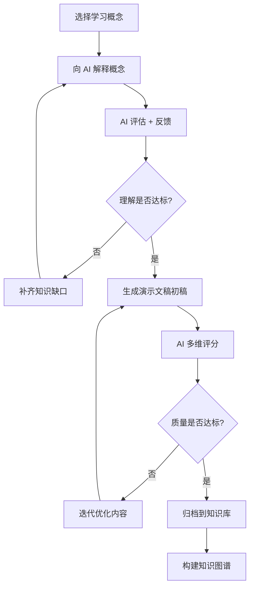

# 双向费曼学习法 (Bidirectional Feynman Technique)

费曼学习法的 AI 时代升级版,用于深度内化知识并生成高质量学习演示文稿。

## 核心理念

传统费曼四步法:
1. 选择概念
2. 向他人解释
3. 识别知识缺口
4. 简化和类比

**双向费曼技术升级**:
- ✅ AI 辅助反馈循环 - 实时评估清晰度和准确性
- ✅ 输出驱动学习 - 转化为具体成果(演示文稿、流程图、代码)
- ✅ 迭代优化 - AI 多维打分,建议改进方向

## 五阶段实施流程

### 阶段 1: 拆解概念 + 设定目标

**目标**: 明确学习范围和预期成果

**步骤**:
1. 选择一个具体概念(如"向量空间"、"React Hooks"、"区块链共识")
2. 定义学习目标(3-5个关键学习点)
3. 设定输出形式(演示文稿、教学大纲、代码示例)

**示例**:
```yaml
概念: React Hooks
学习目标:
  - 理解 useState 和 useEffect 的工作原理
  - 掌握自定义 Hooks 的创建方法
  - 识别常见错误和最佳实践
输出形式: 交互式 HTML 演示文稿
```

### 阶段 2: AI 解释 + 实时反馈

**目标**: 向 AI 解释概念,获得即时评估

**提示词模板**:
```
我正在学习 [概念名称],请评估我的理解:

[你的解释]

请从以下维度评估(0-10分):
- 准确性: 概念是否正确
- 完整性: 是否遗漏关键要点
- 清晰度: 能否让初学者理解
- 深度: 是否触及本质原理

指出我的知识盲点和改进方向。
```

**AI 评估标准**:
- 准确性 ≥ 8: 概念理解正确
- 完整性 ≥ 7: 核心要点覆盖充分
- 清晰度 ≥ 8: 表达简洁易懂
- 深度 ≥ 6: 理解超越表面

### 阶段 3: 补齐知识缺口

**目标**: 针对性学习,填补理解漏洞

**步骤**:
1. 根据 AI 反馈识别薄弱环节
2. 搜索权威资源(官方文档、论文、教程)
3. 深度学习缺失部分
4. 重新向 AI 解释,验证理解

**关键问题**:
- 为什么这个概念重要?
- 它解决什么问题?
- 与其他概念的关系?
- 实际应用场景?

### 阶段 4: 创建输出 + AI 迭代优化

**目标**: 将知识转化为可分享的成果

**输出类型**:
1. **HTML 演示文稿** - 使用本 skill 生成
2. **流程图/思维导图** - 视觉化知识结构
3. **代码示例** - 实践应用
4. **教学大纲** - 结构化知识体系

**AI 评分维度**:
```yaml
内容质量 (30%):
  - 知识准确性 [0-10]
  - 逻辑连贯性 [0-10]
  - 示例质量 [0-10]

教学效果 (30%):
  - 渐进式设计 [0-10]
  - 认知负荷控制 [0-10]
  - 关键概念强调 [0-10]

创新性 (20%):
  - 独特视角 [0-10]
  - 类比质量 [0-10]
  - 可视化创意 [0-10]

实用性 (20%):
  - 实际应用价值 [0-10]
  - 可操作性 [0-10]
  - 可分享性 [0-10]
```

**迭代标准**: 总分 ≥ 85% 为合格, ≥ 95% 为优秀

### 阶段 5: 归档复盘 + 知识图谱构建

**目标**: 建立长效记忆和知识体系

**步骤**:
1. 将演示文稿归档到知识库
2. 标记核心概念和关联知识点
3. 定期复习(间隔重复)
4. 构建个人知识图谱

**知识图谱示例**:
```
React 生态系统
├── 基础概念
│   ├── 组件 → [演示文稿链接]
│   ├── Props → [演示文稿链接]
│   └── State → [演示文稿链接]
├── Hooks
│   ├── useState → [演示文稿链接]
│   ├── useEffect → [演示文稿链接]
│   └── 自定义 Hooks → [演示文稿链接]
└── 高级模式
    ├── Context API
    ├── 性能优化
    └── 并发模式
```

## 与演示文稿生成的整合

### 整合工作流



### 提示词模板

**步骤 1: 概念解释与评估**
```
我正在学习「向量空间」,以下是我的理解:

向量空间是一个集合,其中的元素称为向量,满足加法和标量乘法运算。
零向量是必须存在的,因为它是加法单位元...

[继续解释]

请评估我的理解,指出知识盲点。
```

**步骤 2: 生成演示文稿**
```
请使用 learning-to-html-presentation skill,将我对「向量空间」的理解
转换为演示文稿:

受众: 大学一年级学生
时长: 30 分钟
风格: 温馨教育
核心要点:
- 向量空间的定义和8个公理
- 零向量的必要性
- 实际应用示例

[提供完整学习内容]
```

**步骤 3: 迭代优化**
```
基于上一版演示文稿,请改进以下方面:
- 增加向量空间在机器学习中的应用示例
- 优化第5-8页的视觉层级
- 简化线性变换的解释
```

## 效果评估

### 短期效果 (1周内)
- ✅ 概念理解深度提升 50%+
- ✅ 知识留存率提升 30%+
- ✅ 可分享的高质量学习资产 3-5 份

### 中期效果 (1个月)
- ✅ 建立系统化知识体系
- ✅ 形成个人教学风格
- ✅ 提升元认知能力

### 长期效果 (3个月+)
- ✅ 构建完整知识图谱
- ✅ 培养深度学习习惯
- ✅ 实现滚雪球式成长

## 最佳实践

### DO ✅
- 从小概念开始(单个函数、公式、原理)
- 用自己的语言重新表述
- 寻找真实世界的类比
- 每次迭代专注一个改进点
- 定期回顾已生成的演示文稿

### DON'T ❌
- 不要直接复制粘贴教科书内容
- 不要跳过 AI 评估环节
- 不要追求完美而不敢开始
- 不要孤立学习概念
- 不要忽视知识间的联系

## 示例: 学习 React Hooks

### 阶段 1: 设定目标
```yaml
概念: React Hooks (useState, useEffect)
学习目标:
  - 理解 Hooks 的动机和解决的问题
  - 掌握 useState 的闭包陷阱
  - 理解 useEffect 的依赖数组机制
输出: HTML 演示文稿 + 代码示例
```

### 阶段 2: 向 AI 解释
```
Hooks 是 React 16.8 引入的特性,让函数组件也能使用状态。
useState 返回一个状态值和更新函数,更新时会触发重新渲染。
useEffect 在每次渲染后执行,可以通过依赖数组控制执行时机...

[AI 评估: 准确性 9/10, 完整性 7/10, 清晰度 8/10, 深度 6/10]
[反馈: 缺少对闭包陷阱的深入理解,建议补充...]
```

### 阶段 3: 补齐缺口
- 学习 React 的渲染机制
- 理解闭包在 Hooks 中的作用
- 研究常见错误案例

### 阶段 4: 生成演示文稿
使用本 skill 生成包含:
- 封面: React Hooks 深度解析
- 目录: 5个核心章节
- 内容页: useState 工作原理(配图)
- 代码页: 闭包陷阱示例 + 解决方案
- 对比页: Class vs Hooks
- 总结: 3个关键要点

### 阶段 5: 归档与复习
- 保存到 `knowledge-base/react/hooks/`
- 标记关联: `react-basics`, `closures`, `component-lifecycle`
- 设置复习提醒: 1天后, 1周后, 1月后

## 元认知提升

### 自我反思问题
- 我是否真的理解了,还是只是记住了?
- 我能否不看资料讲解给他人听?
- 我遇到的困难反映了什么知识缺口?
- 这个概念与我已知的哪些知识相关?

### 学习效率指标
- 概念理解时间: ≤ 2小时 (简单), ≤ 8小时 (复杂)
- 演示文稿生成时间: ≤ 30分钟
- 知识留存测试: 1周后 ≥ 80% 回忆准确率

---

## 总结

双向费曼学习法 = **AI 辅助反馈** + **输出驱动内化** + **系统化归档**

通过本 skill 生成的 HTML 演示文稿,不仅是学习成果的展示,更是深度理解的证明。

**开始你的第一次双向费曼**:
1. 选择一个你想深入理解的概念
2. 向 AI 解释它
3. 使用本 skill 生成演示文稿
4. 分享给他人,获得真实反馈
5. 持续迭代,建立知识体系
