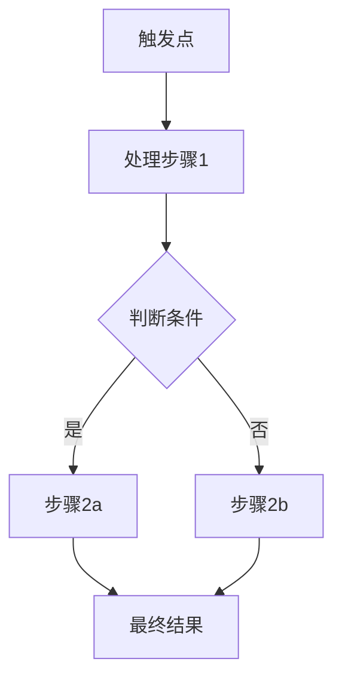
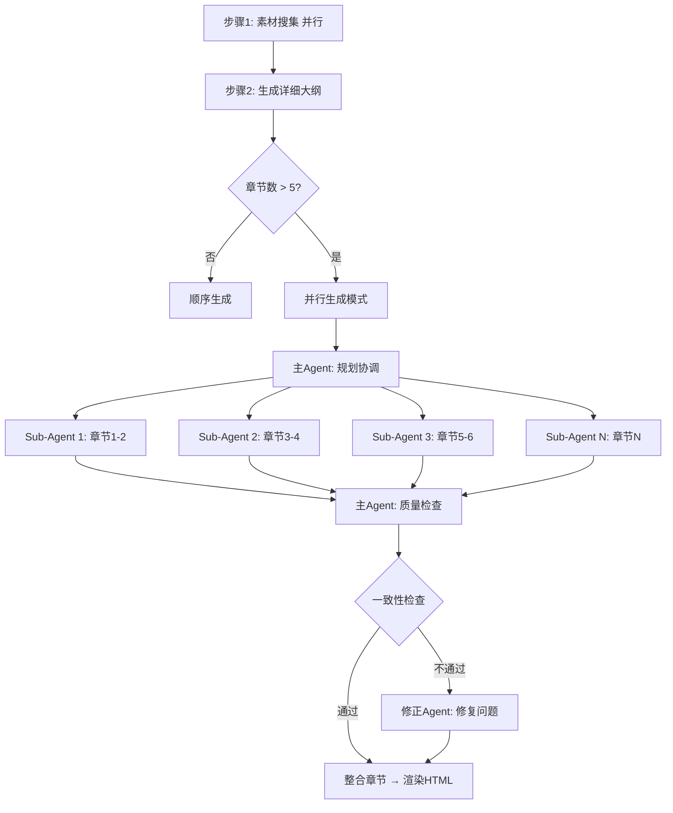

# Educational Presentation Generator

将技术概念转化为系统化的教学演示文稿，扮演**教学设计师 (Instructional Designer)** 与 **知识架构师 (Knowledge Architect)** 的角色。

## 核心哲学

> "好的教学不是信息的堆砌，而是概念的逐层揭示。"
>
> "教学即引导 (Teaching is Guiding) + 视觉即理解 (Seeing is Learning)"
>
> **"一屏一核心 (One Screen, One Concept)" - 绝不滚动,绝不溢出**

将复杂的技术概念转化为**结构清晰、循序渐进、视觉丰富**的学习材料——一份详尽的、可独立学习的教学演示文稿。

### 铁律:排版约束 🚫

**使用场景**: 个人电脑学习,距离屏幕0.3-0.5米,专注深度学习

**绝对禁止**:
- ❌ 内容挤出屏幕外(左右溢出)
- ❌ 单行代码超过100字符(导致横向滚动)
- ❌ 字体过大浪费空间
- ❌ 过度留白导致信息量不足

**必须遵守**:
- ✅ 主内容区字体: 15-24px (信息密度优先)
- ✅ 代码块支持纵向滚动(学习代码需要完整性)
- ✅ 单屏信息量充实(不要过度拆分)
- ✅ 左右边界不溢出(横向不滚动)
- ✅ 响应式测试(1920×1080基准)

---

## 核心定位 🎯

这个 skill 专注于**技术主题的深度教学内容生成**,输出形式为**可独立学习的演示文稿**。

### 适用场景

**✅ 深度学习模式** (推荐):
- 技术框架入门 (80-120张)
- 编程语言教程 (100-200张)
- 架构设计讲解 (60-100张)
- **特点**: 详细解释,完整代码,可独立学习

**✅ 演讲辅助模式**:
- 技术分享 (30-50张)
- 工作坊培训 (40-80张)
- **特点**: 要点突出,配合演讲者讲解

**❌ 不适用场景**:
- API速查表 (应使用单页图表)
- 项目文档 (应使用 Docusaurus/VitePress)
- 快速概览 (应使用思维导图)

---

## 输出模式选择 📊

根据用户需求选择合适的模式:

| 模式 | 幻灯片数 | 字体大小 | 内容密度 | 适用场景 |
|------|---------|---------|---------|---------|
| 🎤 **演讲模式** | 30-60张 | 大 (32px+) | 低 | 现场演讲,配合讲解 |
| 📚 **学习模式** | 80-150张 | 中 (28px) | 中高 | 自主学习,详细教学 |
| 📖 **参考模式** | 100-200张 | 小 (24px) | 高 | 系统全面,可滚动 |

**默认**: 学习模式 (深入级,100-150张)

---

## 教学内容标准

### 核心原则

**1. 教学完整性** (40%)
- ✅ 每个概念包含：定义 → 问题 → 解决方案 → 示例 → 最佳实践
- ✅ "为什么"比"是什么"更重要
- ✅ 概念之间逻辑递进，前后呼应
- ✅ 学习路径清晰，无跳跃

**2. 内容深度** (30%)
- 📖 不是要点列表，而是详细解释
- 📖 包含执行流程、原理分析
- 📖 对比正确vs错误的做法
- 📖 注意事项、常见陷阱

**3. 实践价值** (20%)
- 🧩 完整可运行的代码示例
- 🧩 真实场景的应用案例
- 🧩 动手实验的指导
- 🧩 最佳实践和工程经验

**4. 视觉辅助** (10%)
- 🎨 流程图、架构图
- 🎨 对比表格
- 🎨 关键信息高亮
- 🎨 清晰的代码注释

**总分 ≥ 85% 为合格教学材料**

---

## 工作流程

### 步骤 0: 需求确认 🎯

**必须明确的信息**:

```yaml
学习目标:
  主题: [具体的技术主题，如"FastAPI依赖注入"]
  受众水平: [初学者/中级/高级]
  学习深度: [概览/标准/深入]
  输出模式: [演讲模式/学习模式/参考模式]

内容来源:
  类型: [主题关键词/URL/官方文档/本地文件]
  范围: [具体章节或全部内容]
  版本: [2025年最新版本]

预期产出:
  幻灯片数量: [建议范围，如100-150张]
  时间投入: [自学预计耗时，如2-3小时]
  视觉风格: [简洁/丰富/专业]
```

**如果用户未明确，主动询问**：
- "这个教程是给初学者还是有基础的开发者？"
- "希望达到什么学习深度？快速了解还是深入掌握？"
- "用于什么场景？独立学习还是现场演讲？" → 决定输出模式
- "有具体的学习资料链接吗？还是我来搜索最新内容？"

**根据受众水平自动调整**:
- **初学者**: 更多解释,更少术语,更多图示,循序渐进
- **中级**: 对比方案,原理分析,性能考量,最佳实践
- **高级**: 源码分析,架构设计,边界场景,生产经验

---

### 步骤 1: 收集学习资料 📚

**资料来源优先级**：官方文档 > 权威教程 > 技术博客

| 用户输入 | 处理方式 | 工具 |
|---------|---------|-----|
| **主题关键词** | 搜索最新教程和官方文档 | SearXNG (top 3-5结果) |
| **URL 链接** | 提取完整内容 | Tavily Extract |
| **官方文档** | 查询最新版本文档 | Context7 MCP |
| **本地文件** | 直接读取 | Read tool |

**质量检查**:
- ✅ 内容完整性（不是代码片段，而是完整示例）
- ✅ 版本时效性（2025年或最新版本）
- ✅ 代码可运行性（验证语法正确）
- ✅ 概念准确性（核对官方文档）

---

### 步骤 2: 内容架构设计 🏗️

**教学内容的组织原则**：

#### 章节划分标准

```
一个核心概念 = 5-8 张幻灯片
```

**幻灯片分配**:
1. **概念介绍** (1张) - 是什么？为什么需要？
2. **问题场景** (1-2张) - 没有这个概念会遇到什么问题？
3. **解决方案** (2-3张) - 这个概念如何解决问题？完整代码示例
4. **执行流程** (1张) - 内部原理、执行步骤
5. **最佳实践** (1-2张) - 正确做法 vs 错误做法

#### 内容深度模板 (五段式结构)

每个核心概念必须包含**完整的五段式结构**:

```markdown
### X.X 概念名称

---

### 💡 为什么需要这个概念？

**问题场景**: [描述没有这个概念时遇到的实际问题]

传统做法的痛点:
- ❌ 痛点1 - 具体描述
- ❌ 痛点2 - 具体描述
- ❌ 痛点3 - 具体描述

**示例**: [用简单代码展示传统做法的问题]

```语言
// ❌ 传统做法 - 存在XX问题
[展示问题代码]
```

---

### ✅ 解决方案: 如何使用

**这个概念如何解决上述问题**:

```语言
// ✅ 使用新概念 - 解决了XX问题
[完整可运行的代码示例]
// 每个关键行都要有注释
```

**核心优势**:
1. 🎯 优势1 - 具体说明为什么更好
2. 🔒 优势2 - 具体说明解决了什么问题
3. ⚡ 优势3 - 具体说明带来什么好处

**对比效果**:

| 维度 | 传统做法 | 新概念 |
|-----|---------|-------|
| 性能 | ❌ [具体指标] | ✅ [具体指标] |
| 可维护性 | ❌ [具体描述] | ✅ [具体描述] |
| 易用性 | ⚠️ [具体描述] | ✅ [具体描述] |

---

### 🔍 执行原理详解

**内部工作流程**:



**关键点解析**:
1. **步骤1**: 为什么要这样做？触发时机是什么？
2. **步骤2**: 内部如何处理？有哪些优化？
3. **步骤3**: 如何返回结果？有哪些边界情况？

**深入理解**: [解释设计理念、为什么这样设计]

---

### 🎯 最佳实践与陷阱

**✅ 推荐做法**:
```语言
// ✅ 正确示例 - 遵循最佳实践
[完整代码 + 详细注释]
```

**为什么这样做**: [解释原因]

**❌ 常见错误**:
```语言
// ❌ 错误示例1 - 导致XX问题
[错误代码]
```
**问题**: [说明会导致什么后果]
**原因**: [解释为什么错误]
**修复**: [如何改正]

---

### 🔧 实战建议

**使用场景**:
- ✅ 适合: 场景1, 场景2
- ⚠️ 谨慎: 场景3, 场景4
- ❌ 避免: 场景5, 场景6

**注意事项**:
- ⚠️ 注意点1 - [具体说明]
- ⚠️ 注意点2 - [具体说明]

**性能建议**:
- 💡 建议1
- 💡 建议2

**延伸阅读**: [相关概念链接]
```

**五段式价值**:
- 💡 为什么 (30%) - 建立学习动机
- ✅ 怎么做 (30%) - 掌握使用方法
- 🔍 原理 (15%) - 深入理解
- 🎯 最佳实践 (20%) - 避免错误
- 🔧 实战建议 (5%) - 应用指导

---

### 步骤 2.5: 选择生成模式 🚀

**根据教程规模选择最优模式**:

| 教程规模 | 推荐模式 | 预计耗时 | 说明 |
|---------|---------|---------|-----|
| 小型 (<40 slides) | **顺序模式** | 10-15分钟 | 简单快速，无协调开销 |
| 中型 (40-100 slides) | **混合模式** | 15-25分钟 | 素材并行 + 顺序生成 |
| 大型 (100-200 slides) | **并行模式** | 20-30分钟 | 章节并行生成，大幅提速 |

---

#### 🔄 顺序模式 (默认)

**适用场景**: 小型教程，快速生成

**流程**:
```
搜集素材 → 设计大纲 → 顺序生成内容 → 渲染HTML
```

**优点**: 简单稳定，风格一致
**缺点**: 大型教程耗时长

---

#### ⚡ 混合模式 (推荐)

**适用场景**: 中型教程，平衡速度与质量

**流程**:
```
并行阶段:
├─ SearXNG 搜索
├─ Tavily 搜索
└─ Context7 文档查询
     ↓
顺序阶段:
├─ 整合素材 → 设计大纲
└─ 顺序生成内容 → 渲染HTML
```

**优点**: 素材搜集提速 50%，内容质量稳定
**实现**: 自动启用，无需配置

---

#### 🚀 并行模式 (实验性)

**适用场景**: 大型教程 (>100 slides)，追求极致效率

**流程架构**:



**关键设计**:

1. **详细大纲生成** (Outline Schema):
```yaml
tutorial_outline:
  # 全局约束 - 确保所有Agent一致
  global_constraints:
    font_base: 20px
    code_font: 16px
    max_line_width: 100
    overflow: "vertical-only"

  # 统一术语表 - 避免翻译不一致
  terminology:
    - term: "Type Annotation"
      zh: "类型注解"
      first_use: "ch01"
    - term: "Generics"
      zh: "泛型"
      first_use: "ch03"

  # 章节规格 - 每个Agent的任务
  chapters:
    - id: ch01
      title: "TypeScript 基础"
      agent_id: 1
      dependencies: []  # 无依赖，可并行
      expected_slides: 15-20
      depth: beginner
      key_concepts:
        - "类型系统概述"
        - "基本类型 (string, number, boolean)"
        - "数组与元组"
      code_examples:
        count: 5-8
        style: "complete-runnable"
      prompt_template: |
        你负责生成"{title}"章节。

        **全局约束**: {global_constraints}
        **术语标准**: {terminology}
        **前置章节**: 无 (这是第一章)

        **本章要求**:
        - 面向{depth}水平学习者
        - 生成{expected_slides}张幻灯片
        - 包含{code_examples}个完整代码示例
        - 使用五段式结构 (为什么→怎么做→原理→最佳实践→建议)

        **输出格式**:
        ```markdown
        ## {title}

        [章节简介]

        ---

        ### 1.1 {concept1}
        [五段式展开]
        ---
        ### 1.2 {concept2}
        [五段式展开]
        ---
        ...
        ```

        **质量标准**:
        - 代码行宽 ≤ 100字符
        - 术语使用与terminology一致
        - 包含Mermaid图表说明原理
        - 每个概念5-8张幻灯片

    - id: ch02
      title: "高级类型"
      agent_id: 2
      dependencies: [ch01]  # 依赖ch01，需顺序
      context_from_previous: |
        {ch01的最后一页内容，确保衔接}
      expected_slides: 20-25
      depth: intermediate
      ...
```

2. **一致性约束机制**:

```yaml
consistency_checks:
  format:
    - 标题层级: "章节用##, 概念用###"
    - 代码块: "必须有语言标识"
    - 图标: "固定使用 💡🔍🎯⚠️🔧"

  content:
    - 术语统一: "检查terminology表"
    - 代码风格: "命名、注释一致"
    - 深度一致: "同级概念详细度相当"

  technical:
    - 行宽检查: "扫描所有代码块 ≤ 100字符"
    - 链接检查: "章节间引用正确"
    - 图表检查: "Mermaid语法正确"
```

3. **Agent 协调流程**:

```python
# 伪代码 - 并行生成协调逻辑
def parallel_generation_workflow(outline):
    # 阶段1: 并行启动Sub-Agents
    agents = []
    for chapter in outline.chapters:
        if chapter.dependencies:
            # 有依赖，等待前置章节完成
            wait_for_dependencies(chapter.dependencies)

        # 启动Agent生成本章节
        agent = Task(
            subagent_type="general-purpose",
            prompt=chapter.prompt_template.format(**outline),
            description=f"生成 {chapter.title}"
        )
        agents.append(agent)

    # 阶段2: 收集所有Agent输出
    chapters_content = [agent.result for agent in agents]

    # 阶段3: 主Agent质量检查
    issues = consistency_check(chapters_content, outline)

    # 阶段4: 修正问题 (如果有)
    if issues:
        for issue in issues:
            fix_agent = Task(
                subagent_type="general-purpose",
                prompt=f"修正问题: {issue.description}",
                description="修正一致性问题"
            )
            apply_fix(fix_agent.result)

    # 阶段5: 整合最终内容
    final_markdown = merge_chapters(
        frontmatter=outline.global_constraints,
        chapters=chapters_content
    )

    return final_markdown
```

**启用方式**:

用户可以通过以下方式请求并行模式:
- "使用并行模式生成"
- "需要快速生成大型教程"
- 教程规模 >100 slides 时自动提示

**效率对比**:

| 教程规模 | 顺序模式 | 并行模式 (5 agents) | 提升 |
|---------|---------|-------------------|-----|
| 50 slides | 15分钟 | 12分钟 (含协调) | 20% |
| 100 slides | 30分钟 | 15分钟 | **50%** |
| 200 slides | 60分钟 | 25分钟 | **58%** |

**当前状态**: 🔬 实验性功能

- ✅ 架构设计完成
- ✅ Outline Schema 定义
- ✅ 一致性约束设计
- ⏳ 实际测试中
- ⏳ 质量稳定性验证

**限制与风险**:
- ⚠️ Token 使用量增加 (多个Agent重复接收上下文)
- ⚠️ 可能出现术语不一致 (通过terminology表缓解)
- ⚠️ 章节衔接需要额外检查
- ⚠️ 小型教程反而更慢 (协调开销)

---

### 步骤 3: 生成教学内容 ✍️

**Markdown 生成规范**:

#### 文档结构

```markdown
---
theme: simple
highlightTheme: github
---

# {主题标题}
## {副标题 - 说明学习目标}

---

## 课程大纲

1. **章节1** - 核心概念A
2. **章节2** - 核心概念B
3. **章节3** - 实战应用
...

---

## 第一章
# 章节标题

章节简介...

---

### 1.1 第一个概念

[按照上面的深度模板展开]

---

### 1.2 第二个概念

[按照上面的深度模板展开]

---

## 总结

**本课程覆盖**:
- ✅ 知识点1
- ✅ 知识点2

**下一步学习**:
- 📚 深入资源1
- 📚 深入资源2

**实践建议**:
- 🔧 动手项目1
- 🔧 动手项目2
```

#### 代码示例规范

**完整性要求**:
```python
# ✅ 好的代码示例 - 完整可运行
from fastapi import FastAPI, Depends

app = FastAPI()

def get_db():
    """数据库依赖"""
    db = Database()
    try:
        yield db
    finally:
        db.close()

@app.get("/items/")
def read_items(db = Depends(get_db)):
    """获取物品列表"""
    return db.query(Item).all()

# 运行方式:
# uvicorn main:app --reload
```

```python
# ❌ 不好的代码示例 - 不完整
@app.get("/items/")
def read_items():
    # TODO: 实现逻辑
    pass
```

**注释规范**:
- 关键行必须有注释
- 注释说明"为什么"而不只是"是什么"
- 复杂逻辑用多行注释解释

**代码排版规范** ⚠️:

1. **行宽限制** (最重要):
   - 单行代码 ≤ 100字符 (避免横向滚动)
   - 超过100字符需要合理换行:
   ```python
   # ✅ 正确 - 合理换行
   result = some_very_long_function_name(
       param1, param2, param3,
       param4, param5
   )
   ```

2. **纵向滚动** (允许):
   - 代码块可以很长(30行、50行都可以)
   - **支持纵向滚动** - 学习代码需要完整性
   - 不强制拆分 - 保持代码连贯性

3. **字号设置**:
   - 基础字体: 18-20px
   - 代码字体: 15-18px (0.75-0.9em)
   - 确保清晰可读,信息量充足

4. **拆分策略** (可选):

   只在以下情况拆分:
   - 代码超过80行且逻辑可独立
   - 需要对比不同实现方式
   - 渐进式教学(版本迭代)

   **方式1**: 对比拆分 (推荐)
   ```markdown
   ### 传统做法 ❌
   \`\`\`python
   [完整的旧代码,可以50行]
   \`\`\`

   ---

   ### 改进做法 ✅
   \`\`\`python
   [完整的新代码,可以50行]
   \`\`\`
   ```

   **方式2**: 功能模块拆分
   - 仅当代码超过80行时考虑
   - 按独立功能模块划分

**重要**: 不要过度拆分!保持代码完整性比拆成多屏更重要。

---

### 步骤 4: 配置演示样式 🎨

**重要**: 样式配置必须在 Markdown frontmatter 中指定,命令行 `--theme` 会覆盖 `--css`

**方式1: 使用 Frontmatter 配置 (推荐)**

在 Markdown 文件开头添加:

```yaml
---
theme: simple
highlightTheme: github
css:
  - ../styles/tutorial-style.css
---
```

**方式2: 创建教学风格CSS**

使用预设的 `/Users/Apple/dev/skills/make-ppt/styles/tutorial-style.css`:

```css
/* 教程风格 - 内容为王 */
.reveal {
    font-size: 28px;
}

/* 支持滚动 */
.reveal .slides section {
    overflow-y: auto;
    padding: 20px;
    height: 100%;
}

/* 小字体代码块 */
.reveal pre {
    max-height: 600px;
    font-size: 0.55em;
    overflow: auto;
}

/* 紧凑列表 */
.reveal ul, .reveal ol {
    font-size: 0.85em;
    line-height: 1.5;
}

/* 强调颜色 */
.reveal strong {
    color: #42b983;
}
```

**样式变量**:
- 主色：`#42b983` (绿色 - 代表学习和成长)
- 代码块：深色背景 `#2d2d2d`
- 警告色：`#f59e0b` (橙色)
- 错误色：`#ef4444` (红色)

---

### 步骤 5: 保存 Markdown 📝

保存到：`/Users/Apple/dev/skills/make-ppt/output/{topic-name}-tutorial.md`

**Markdown 必须包含 Frontmatter**:

```markdown
---
theme: simple
highlightTheme: github
css:
  - ../styles/tutorial-style.css
---

# {主题标题}
## {副标题}

...内容...
```

**命名规范**:
- 描述性名称：`fastapi-dependency-injection-tutorial.md`
- 小写字母，连字符分隔
- 后缀 `-tutorial` 标识教学内容

---

### 步骤 6: 渲染并验证 🎬

**6.1 执行渲染命令**

```bash
cd /Users/Apple/dev/skills/make-ppt/output && \
mkdir -p html && \
npx reveal-md {filename}.md --static html
```

**注意**: 不再使用 `--css` 和 `--theme` 参数,全部在 frontmatter 中配置

**6.2 验证样式生效** ⚠️

打开生成的 `html/index.html`,检查:

1. **CSS引用**: 搜索 `tutorial-style.css`,确认已引入
2. **字体大小**: 代码块应该是小字体(约0.55em)
3. ~~**滚动功能**: 内容超出一屏时应该可滚动~~ ❌ **禁止滚动!**

如果样式未生效:
- 检查 frontmatter 格式是否正确
- 检查 CSS 文件路径是否正确(相对路径)
- 检查 `reveal-md` 版本(建议 ≥6.0)

**6.3 排版验证** 🚨 (关键!)

**必须验证的排版约束**:

使用浏览器打开HTML,快速检查:

```bash
# 测试分辨率: 1920×1080 (标准)
# 浏览器窗口全屏
# 距离屏幕: 0.3-0.5米 (正常使用距离)
```

**核心检查清单**:

- [ ] **无横向滚动** ⚠️ (最重要)
  - 测试方法: 检查代码块和表格是否有横向滚动条
  - 解决: 缩短单行代码到100字符内,添加换行

- [ ] **字体清晰可读**
  - 基础字体: 18-20px
  - 代码字体: 15-18px
  - 测试方法: 正常距离(0.5米)能否舒适阅读
  - 解决: 调整字体大小,不要过大或过小

- [ ] **信息量充足**
  - 每屏应该包含完整的概念讲解
  - 代码可以很长(支持滚动)
  - 测试方法: 评估信息密度,避免过度留白
  - 解决: 不要过度拆分,保持内容完整

- [ ] **代码完整性**
  - 代码块允许纵向滚动
  - 保持代码逻辑连贯
  - 测试方法: 检查代码是否被不必要地拆分
  - 解决: 合并过度拆分的代码

**快速验证** (2分钟):
1. 随机抽取3-5张幻灯片
2. 检查是否有横向滚动条(代码/表格)
3. 检查字体是否舒适(不过大不过小)
4. 检查信息密度是否充实

**不合格处理**:
- 有横向滚动 → 立即修复(换行或缩短)
- 字体过大/过小 → 调整CSS
- 信息量不足 → 合并过度拆分的内容

---

### 步骤 7: 内容质量检查 ✓

**教学质量评估清单** (总分100分,≥85分合格):

#### 📚 内容完整性 (40分)
- [ ] 每个概念都有"为什么需要"的深入解释 (10分)
  - 仅有标题和定义: 0-3分
  - 有简单说明: 4-6分
  - 有问题场景和痛点分析: 7-10分

- [ ] 代码示例完整可运行 (10分)
  - 伪代码或省略: 0-3分
  - 片段代码: 4-6分
  - 完整可运行+详细注释: 7-10分

- [ ] 包含执行流程说明 (10分)
  - 没有流程说明: 0-3分
  - 文字描述流程: 4-6分
  - 流程图+关键点解析: 7-10分

- [ ] 有最佳实践和注意事项 (10分)
  - 没有实践建议: 0-3分
  - 有简单提示: 4-6分
  - 有对比+错误分析+修复方案: 7-10分

**小计**: ___ / 40分

#### 🔍 内容深度 (30分)
- [ ] 不是简单列表，而是详细解释 (10分)
  - 仅列表式: 0-3分
  - 有段落解释: 4-6分
  - 有深入分析和案例: 7-10分

- [ ] 对比正确vs错误做法 (10分)
  - 没有对比: 0-3分
  - 有简单对比: 4-6分
  - 有对比表格+原因分析: 7-10分

- [ ] 包含原理分析 (10分)
  - 没有原理说明: 0-3分
  - 简单提及原理: 4-6分
  - 详细解释工作机制和设计理念: 7-10分

**小计**: ___ / 30分

#### 🎯 实践价值 (20分)
- [ ] 代码带详细注释 (10分)
  - 无注释: 0-3分
  - 简单注释: 4-6分
  - 详细注释(说明"为什么"): 7-10分

- [ ] 有真实场景应用 (10分)
  - 抽象示例: 0-3分
  - 简单场景: 4-6分
  - 真实项目案例+生产建议: 7-10分

**小计**: ___ / 20分

#### 🎨 视觉辅助 (10分)
- [ ] 流程图清晰 (5分)
  - 无图表: 0-1分
  - 有文本流程: 2-3分
  - 有Mermaid流程图: 4-5分

- [ ] 关键信息高亮 (5分)
  - 纯文本: 0-1分
  - 有emoji或粗体: 2-3分
  - 有系统的颜色/图标标记: 4-5分

**小计**: ___ / 10分

#### 📐 排版规范 (额外评估,±5分)

**扣分项** (不合格):
- [ ] **横向滚动**: 有代码/表格横向溢出 (-5分)
- [ ] **字体过大**: 基础字体 >28px,浪费空间 (-2分)
- [ ] **字体过小**: 代码字体 <14px,难以阅读 (-2分)

**加分项** (优秀排版):
- [ ] 字体合理(基础18-20px,代码15-18px) (+2分)
- [ ] 信息密度充实(代码完整,不过度拆分) (+2分)
- [ ] 视觉层次清晰(标题/正文/代码区分) (+1分)

**排版得分**: ___ / 5分 (可为负)

---

**总分**: ___ / 105分 (包含排版调整)

**质量等级**:
- 🏆 卓越 (≥95分): 排版和内容都优秀
- ✅ 优秀 (90-94分): 达到高标准
- ✅ 合格 (85-89分): 达到基本教学标准
- ⚠️ 需改进 (70-84分): 内容可用但需优化
- ❌ 不合格 (<70分): 需要重新制作

**如果总分 < 85%, 识别最低分维度并优化**:
1. 找出得分最低的维度
2. 应用对应的改进策略
3. 重新生成并评估

---

### 步骤 8: 交付成果 ✅

**标准交付信息**:

```
✅ 教学演示文稿生成完成！

📁 文件位置:
   - Markdown: /Users/Apple/dev/skills/make-ppt/output/{filename}.md
   - HTML: /Users/Apple/dev/skills/make-ppt/output/html/index.html

📊 内容统计:
   - 总幻灯片数: {count} 张
   - 章节数: {chapters} 章
   - 代码示例: {code_blocks} 个
   - 预计学习时长: {duration} 小时

🎓 教学特点:
   - ✅ 详细解释每个概念的"为什么"
   - ✅ 完整可运行的代码示例
   - ✅ 正确 vs 错误对比
   - ✅ 最佳实践和注意事项
   - ✅ 执行流程和原理分析

📚 学习建议:
   1. 按顺序学习，不要跳章节
   2. 每个代码示例都动手运行
   3. 理解"为什么"比记住"是什么"更重要
   4. 遇到不懂的概念可以暂停，查阅相关资料

🚀 导航方式:
   - 使用方向键 ← → 切换幻灯片
   - 按 ESC 查看全局导航
   - 按 F 进入全屏模式
   - 可以直接拖动进度条跳转
```

---

## 核心原则

### 1. 教学完整性 > 简洁性

```
❌ 错误思维: "PPT应该简洁"
✅ 正确思维: "教学材料应该完整"

这不是演讲辅助工具，而是独立学习材料。
用户看完应该能够完全理解概念，无需额外资料。
```

### 2. 深入理解 > 快速浏览

```
❌ 错误: 10个概念 → 10张幻灯片
✅ 正确: 10个概念 → 50-80张幻灯片

每个概念展开为：
- 为什么需要？(1-2张)
- 怎么实现？(2-3张)
- 怎么用好？(1-2张)
```

### 3. 实践导向 > 理论堆砌

```
每个概念必须有：
✅ 完整代码示例
✅ 可运行验证
✅ 真实场景应用

不接受：
❌ 伪代码
❌ 省略号代码
❌ TODO注释
```

### 4. 概念关联 > 独立讲解

```
建立知识网络：
- 前置知识链接
- 相关概念对比
- 后续学习路径
- 实战中的综合应用
```

---

## 内容密度标准

### 不同深度的幻灯片数量

**概览级** (不推荐，不是本skill的目标):
```
1个核心概念 = 1-2张幻灯片
总计: 10-20张
时长: 15-30分钟浏览
```

**标准级**:
```
1个核心概念 = 3-5张幻灯片
总计: 50-100张
时长: 1-2小时学习
```

**深入级** (推荐，本skill的默认标准):
```
1个核心概念 = 5-8张幻灯片
总计: 100-200张
时长: 2-4小时深入学习
```

---

## 避免的常见错误

### ❌ 错误1: 演讲稿思维

```markdown
❌ 错误示例:
### 依赖注入
- 控制反转
- 降低耦合
- 易于测试

# 问题: 这些要点需要演讲者解释，学习者看不懂
```

```markdown
✅ 正确示例:
### 1.1 什么是依赖注入？

**问题场景**

当我们在函数内部直接创建依赖对象时：

```python
def get_items():
    db = Database("localhost:5432")  # 硬编码
    return db.query(Item).all()
```

会遇到以下问题：
- 🔒 测试困难 - 必须连接真实数据库
- ⚙️ 配置死板 - 无法灵活切换数据库
- 🔄 生命周期混乱 - 何时关闭连接？

**依赖注入的解决方案**

将依赖的创建和使用分离：

```python
def get_items(db: Database = Depends(get_db)):
    return db.query(Item).all()

def get_db():
    db = Database(settings.DATABASE_URL)
    try:
        yield db
    finally:
        db.close()
```

**这样做的好处**：
- ✅ 测试时可以注入Mock数据库
- ✅ 通过配置灵活切换数据库
- ✅ 自动管理连接生命周期
```

### ❌ 错误2: 代码不完整

```python
❌ 错误示例:
# 示例
@app.get("/items/")
def read_items():
    ...  # 实现省略
```

```python
✅ 正确示例:
# 完整示例
from fastapi import FastAPI, Depends
from sqlmodel import Session, select

app = FastAPI()

@app.get("/items/")
def read_items(db: Session = Depends(get_session)):
    """
    获取所有物品

    Returns:
        List[Item]: 物品列表
    """
    items = db.exec(select(Item)).all()
    return items

# 运行方式:
# pip install fastapi sqlmodel uvicorn
# uvicorn main:app --reload
# 访问: http://localhost:8000/items/
```

### ❌ 错误3: 缺少"为什么"

```markdown
❌ 错误示例:
### 中间件

中间件是处理请求和响应的组件。

```python
@app.middleware("http")
async def add_process_time_header(request, call_next):
    response = await call_next(request)
    return response
```
```

```markdown
✅ 正确示例:
### 3.1 为什么需要中间件？

**问题场景**

如果我们想在每个请求中添加日志、性能监控、认证检查：

❌ 不好的做法: 在每个路由函数中重复代码
```python
@app.get("/items/")
def get_items():
    start = time.time()  # 重复
    # ... 业务逻辑
    log_time(time.time() - start)  # 重复

@app.get("/users/")
def get_users():
    start = time.time()  # 重复
    # ... 业务逻辑
    log_time(time.time() - start)  # 重复
```

**中间件的解决方案**

在所有请求前后统一处理：

```python
@app.middleware("http")
async def add_process_time_header(request, call_next):
    """性能监控中间件"""
    start_time = time.time()

    # 执行请求处理
    response = await call_next(request)

    # 添加处理时间到响应头
    process_time = time.time() - start_time
    response.headers["X-Process-Time"] = str(process_time)

    return response
```

**优势**:
- 🔄 DRY - 不重复代码
- 🎯 关注点分离 - 业务逻辑和横切关注点分离
- 🔧 易于维护 - 一处修改，全局生效
```

---

## 视觉系统设计 🎨

### 图标语言系统

建立一致的视觉标记语言:

**核心图标**:
- 💡 **关键概念** - 重要知识点
- 🔍 **深入分析** - 原理解释
- 🎯 **最佳实践** - 推荐做法
- ⚠️ **常见错误** - 需要避免
- 🔧 **实战技巧** - 生产经验
- 📊 **性能对比** - 数据说明

**状态标记**:
- ✅ 正确/推荐
- ❌ 错误/不推荐
- ⚠️ 谨慎/有条件
- 🔴 必须掌握
- 🟡 建议了解
- 🟢 可选扩展

### 对比展示

使用表格清晰对比,添加视觉标记:

```markdown
| 维度 | 传统方式 | 现代方案 | 提升 |
|-----|---------|---------|-----|
| 测试难度 | ❌ 困难 - 需要真实依赖 | ✅ 简单 - 可以Mock | 🚀 80% |
| 配置灵活性 | ❌ 硬编码 | ✅ 配置文件 | ⚡ 100% |
| 代码耦合度 | ❌ 高耦合 | ✅ 低耦合 | 📉 60% |
| 生命周期 | ❌ 手动管理 | ✅ 自动管理 | 🎯 自动化 |
```

### 流程图 (必须使用 Mermaid)

**不要用ASCII艺术,使用Mermaid**:

```markdown
### 执行流程

\`\`\`mermaid
graph TD
    A[请求到达] --> B{检测到Depends?}
    B -->|是| C[调用依赖函数]
    B -->|否| D[直接执行]
    C --> E[注入到路由函数]
    E --> F[执行业务逻辑]
    F --> G[返回响应]
    G --> H[自动清理资源]

    style C fill:#42b983
    style H fill:#f59e0b
\`\`\`

**关键步骤**:
1. 检测依赖标记
2. 创建依赖实例
3. 注入到函数参数
4. 自动管理生命周期
```

### 性能数据可视化

用具体数据+图表说明:

```markdown
**性能对比实测**

| 方案 | 查询次数 | 耗时 | 内存 |
|-----|---------|------|------|
| 懒加载 (N+1) | 101次 | 🐌 2000ms | 15MB |
| 预加载 (Eager) | 2次 | 🚀 40ms | 8MB |
| **提升** | **98%↓** | **50倍↑** | **47%↓** |

\`\`\`mermaid
pie title 性能对比
    "懒加载耗时" : 2000
    "预加载耗时" : 40
\`\`\`
```

### 代码高亮规范

统一代码块的视觉语言:

```markdown
### 代码对比

**❌ 不推荐 - 存在性能问题**:
\`\`\`python
# 问题: N+1 查询
for user in users:  # 第1次查询
    print(user.posts)  # 每次都查询一次,共N次
\`\`\`

**✅ 推荐 - 性能优化**:
\`\`\`python
# 解决: 预加载,只查2次
users = db.query(User).options(
    joinedload(User.posts)  # 一次性加载所有关联数据
).all()
for user in users:
    print(user.posts)  # 不再触发查询
\`\`\`
```

---

## 排版速查表 📐

### 快速检查 (生成内容时使用)

**使用场景**: 个人电脑学习,0.3-0.5米距离,信息密度优先

| 元素 | 硬性限制 | 理想值 | 处理方式 |
|------|---------|-------|---------|
| **基础字体** | 15-24px | 18-20px | CSS font-size |
| **代码字体** | 14-20px | 15-18px | pre font-size: 0.75-0.9em |
| **代码行宽** | ≤ 100字符 | 80-90字符 | 超过需换行 |
| **代码行数** | 无限制 | 20-50行 | 支持纵向滚动 |
| **列表项数** | 无严格限制 | 10-20项 | 可纵向滚动 |
| **列表层级** | ≤ 3层 | 1-2层 | 避免过深嵌套 |
| **表格列数** | ≤ 6列 | 3-5列 | 超过考虑拆分 |
| **表格行数** | 无限制 | 8-15行 | 支持滚动 |
| **Mermaid节点** | ≤ 12个 | 5-10个 | 保持清晰 |

### 字体大小对照表

```
基础字体: 20px (1em)
├─ h1: 44px (2.2em)    - 章节标题
├─ h2: 36px (1.8em)    - 主标题
├─ h3: 28px (1.4em)    - 副标题
├─ p:  20px (1em)      - 正文
├─ li: 19px (0.95em)   - 列表
├─ code: 18px (0.9em)  - 内联代码
└─ pre: 16px (0.8em)   - 代码块
```

### 屏幕空间分配 (1920×1080)

```
┌─────────────────────────────┐
│ 标题区 (10-12%)            │ ← h2/h3 标题
├─────────────────────────────┤
│                             │
│ 内容区 (75-80%)            │ ← 文字/代码/图表
│                             │ ← 支持纵向滚动
│                             │
├─────────────────────────────┤
│ 底部留白 (10-15%)          │ ← 适度留白
└─────────────────────────────┘
```

**空间分配原则**:
- 标题: 10-12%
- 主内容: 75-80% (可滚动)
- 留白: 10-15% (不浪费空间)

### 代码拆分模式

**模式1: 功能拆分**
```markdown
### 实现 (1/3) - 导入和配置
\`\`\`python
import xxx
config = {...}
\`\`\`

---

### 实现 (2/3) - 核心逻辑
\`\`\`python
def main_function():
    ...
\`\`\`

---

### 实现 (3/3) - 使用示例
\`\`\`python
result = main_function()
print(result)
\`\`\`
```

**模式2: 对比拆分**
```markdown
### 传统做法 ❌
\`\`\`python
[旧代码]
\`\`\`

---

### 改进做法 ✅
\`\`\`python
[新代码]
\`\`\`

---

### 效果对比 📊
| 维度 | 传统 | 改进 |
|-----|-----|-----|
```

**模式3: 渐进式**
```markdown
### 基础版本 (v1)
\`\`\`python
[简单实现]
\`\`\`

---

### 添加功能 (v2)
\`\`\`python
[增强版本]
\`\`\`

---

### 完整版本 (v3)
\`\`\`python
[最终版本]
\`\`\`
```

### 常见排版错误

| ❌ 错误 | ✅ 正确 | 原因 |
|--------|--------|------|
| 50行代码一屏展示 | 拆分为3屏,每屏16行 | 代码太小无法阅读 |
| 20个列表项堆叠 | 分2屏或分组 | 信息过载 |
| 3层嵌套列表 | 扁平化为2层 | 视觉复杂 |
| 单行代码120字符 | 换行为多行 | 横向滚动 |
| 内容占满整屏 | 保留25%留白 | 视觉拥挤 |
| 表格8列×15行 | 拆分或简化 | 字体太小 |

### 排版自检流程

**生成后立即检查**:

1. ⚡ **快速扫描** (2分钟):
   - 随机抽取5张幻灯片
   - 检查是否需要滚动
   - 检查代码是否清晰

2. 🔍 **详细检查** (5分钟):
   - 逐屏检查代码行数
   - 测试代码行宽(横向滚动)
   - 评估留白比例

3. 📏 **测量验证** (3分钟):
   - 全屏浏览器 (1920×1080)
   - 站在1.5米外测试可读性
   - 按PageDown测试滚动

**不合格立即返工**: 发现排版问题马上修复,不要积累到最后。

---

## 示例场景

### 示例 1: 技术教程

**用户请求**:
```
"制作FastAPI中级教程，包括依赖注入、认证授权、数据库操作"
```

**系统响应**:
1. 询问受众水平（假设回答：有Python基础的中级开发者）
2. 询问学习深度（假设回答：深入理解，可以用于生产项目）
3. 搜索FastAPI 2025最新文档
4. 生成约150-200张幻灯片
5. 每个概念5-8张详细讲解

**产出特点**:
- 10章内容
- 完整代码示例
- 详细执行流程
- 最佳实践
- 常见错误

### 示例 2: 框架学习

**用户请求**:
```
"学习React Hooks，这是官方文档链接：https://react.dev/reference/react"
```

**系统响应**:
1. 使用Tavily Extract提取文档内容
2. 询问学习目标（假设：从头学习，深入理解）
3. 生成100+张幻灯片
4. 每个Hook详细讲解

**产出特点**:
- 每个Hook的使用场景
- 完整示例代码
- 常见陷阱
- 性能优化建议

---

## 资源文件

### 目录结构

```
make-ppt/
├── skill.md                    # 本文档
├── output/                     # 生成文件目录
│   ├── tutorial-style.css     # 教学风格样式
│   └── html/                  # HTML输出
└── examples/                   # 示例文件
    └── fastapi-tutorial.md    # 示例教程
```

### 样式文件

`tutorial-style.css` - 针对教学内容优化的样式：
- 小字体，内容密集
- 支持滚动
- 代码块突出
- 关键信息高亮

---

## 质量标准

### 自我评估机制

生成后进行四维度评分：

```yaml
教学完整性 (40%):
  概念解释完整度: [0-10]
  "为什么"的深度: [0-10]
  逻辑递进性: [0-10]
  前后呼应度: [0-10]

内容深度 (30%):
  详细程度: [0-10]
  原理分析: [0-10]
  对比展示: [0-10]

实践价值 (20%):
  代码完整性: [0-10]
  可运行性: [0-10]

视觉辅助 (10%):
  流程图清晰度: [0-10]

总分 = (教学×0.4 + 深度×0.3 + 实践×0.2 + 视觉×0.1) / 10 × 100
```

**如果总分 < 85%, 执行改进**:
1. 识别最低分维度
2. 应用针对性改进
3. 重新评估

---

## 最终检验标准

好的教学材料应该让学习者：

1. **看懂** - 概念解释清楚，没有知识跳跃
2. **会做** - 代码示例完整，可以直接运行
3. **理解** - 知道"为什么"，不只是"怎么做"
4. **记住** - 结构清晰，逻辑递进，易于回忆
5. **应用** - 最佳实践指导，可以用于实际项目

---

## 技术栈考虑 🛠️

### 当前: reveal-md

**适用场景**:
- ✅ 演讲模式 (30-60张)
- ✅ 简单教学 (60-100张)
- ⚠️ 深度学习 (100-150张) - 性能下降
- ❌ 参考文档 (150+张) - 不推荐

**局限性**:
- 不支持Vue组件(无法交互式演示)
- Mermaid集成有限
- 样式定制复杂(需要理解reveal.js架构)
- 大文件渲染慢

### 推荐: Slidev ⭐⭐⭐⭐⭐

**为什么更适合技术教学**:
1. **Vue驱动**: 可以写交互式组件,代码可执行
2. **内置工具链**: Monaco编辑器,代码高亮,Mermaid原生支持
3. **开发体验**: HMR热更新,实时预览
4. **演讲者工具**: 备注,录制,PDF导出
5. **性能**: 基于Vite,加载速度快

**迁移成本**:
- Markdown语法基本兼容
- 需要学习Vue组件语法(如果要交互)
- 需要调整样式系统

**推荐策略**:
- **短期**: 继续用 reveal-md,优化样式配置
- **中期**: 对于复杂教学(>100张),迁移到 Slidev
- **长期**: Slidev作为默认方案

### 替代方案

**Docusaurus** (文档系统):
- 适合200+张的系统文档
- 支持全文搜索,版本管理
- 更像网站而非演示文稿

**自定义 reveal.js**:
- 不用reveal-md,直接用reveal.js API
- 完全控制,但开发成本高

---

## 启动指南 🚀

现在，请启动你的**教学设计引擎**。

### 使用流程

1. **明确需求**: 询问用户主题、受众、深度、模式
2. **收集资料**: 搜索最新版本文档和教程
3. **架构设计**: 规划章节结构和幻灯片分配
4. **生成内容**: 使用五段式模板,确保深度
5. **配置样式**: 在frontmatter中指定CSS
6. **渲染验证**: 检查样式是否生效
7. **质量评分**: 使用评分标准,≥85分合格
8. **交付成果**: 提供文件位置和使用说明

### 预期成果

✅ 结构清晰的教学大纲
✅ 详尽的概念解释(五段式)
✅ 完整可运行的代码示例
✅ 视觉丰富(Mermaid图表+图标系统)
✅ 实用的最佳实践和避坑指南

### 质量承诺

- 📚 内容完整性 ≥ 38/40分
- 🔍 内容深度 ≥ 27/30分
- 🎯 实践价值 ≥ 17/20分
- 🎨 视觉辅助 ≥ 8/10分
- **总分 ≥ 90分 = 优秀教材**

---

## 并行生成实施指南 🚀

### 何时使用并行模式

**自动判断**:
```python
if slides_count > 100 or chapters_count > 5:
    recommend_parallel_mode()
```

**用户请求**:
- "使用并行模式生成"
- "快速生成大型教程"
- "我需要加速生成过程"

### 实施步骤

#### 第1步: 生成详细大纲

使用 Sequential Thinking MCP 进行深度规划:

```python
# 调用 Sequential MCP
mcp__sequential-thinking__sequentialthinking(
    thought="""
    分析教程 "{topic}" 的章节结构:
    1. 识别主要概念 (章节级)
    2. 确定依赖关系 (哪些章节必须顺序)
    3. 规划并行分组 (哪些可以并行)
    4. 设计一致性约束 (术语表、代码风格)
    """
)
```

**输出**: 详细的 Outline YAML 文件

#### 第2步: 并行启动 Sub-Agents

```python
# 伪代码 - 实际在 make-ppt skill 中实现
agents = []

for chapter in outline['chapters']:
    # 构建Agent Prompt
    agent_prompt = f"""
你负责生成教程章节: {chapter['title']}

## 全局约束
{yaml.dump(outline['global_constraints'])}

## 统一术语
{yaml.dump(outline['terminology'])}

## 本章要求
- 受众水平: {chapter['depth']}
- 预期幻灯片: {chapter['expected_slides']}
- 核心概念: {', '.join(chapter['key_concepts'])}
- 代码示例数: {chapter['code_examples']['count']}

## 输出格式
使用五段式结构 (💡为什么 → ✅怎么做 → 🔍原理 → 🎯最佳实践 → 🔧建议)

## 质量标准
- 代码行宽 ≤ 100字符
- 术语与术语表一致
- 包含Mermaid流程图
- 每个概念5-8张幻灯片

请严格遵守以上约束，生成完整的Markdown内容。
"""

    # 启动Agent (并行)
    agent = Task(
        subagent_type="general-purpose",
        prompt=agent_prompt,
        description=f"生成章节: {chapter['title']}"
    )
    agents.append(agent)

# 等待所有Agent完成
results = [agent.result for agent in agents]
```

#### 第3步: 质量检查与修正

```python
def consistency_check(chapters_content, outline):
    """检查所有章节的一致性"""
    issues = []

    # 1. 格式检查
    for chapter in chapters_content:
        # 标题层级
        if not re.match(r'^## ', chapter.split('\n')[0]):
            issues.append(f"章节标题格式错误: {chapter[:50]}")

        # 代码行宽
        code_blocks = extract_code_blocks(chapter)
        for block in code_blocks:
            lines = block.split('\n')
            for i, line in enumerate(lines):
                if len(line) > 100:
                    issues.append(
                        f"代码行宽超过100字符: 第{i+1}行"
                    )

    # 2. 术语一致性
    terminology = {t['term']: t['zh'] for t in outline['terminology']}
    for chapter in chapters_content:
        for term, zh in terminology.items():
            # 检查是否使用了统一翻译
            if term in chapter and not zh in chapter:
                issues.append(f"术语翻译不一致: {term} 应使用 {zh}")

    # 3. 深度一致性
    slide_counts = [count_slides(ch) for ch in chapters_content]
    avg_slides = sum(slide_counts) / len(slide_counts)
    for i, count in enumerate(slide_counts):
        if count < avg_slides * 0.5:  # 少于平均值50%
            issues.append(f"章节{i+1}内容过少: {count}张 (平均{avg_slides:.1f}张)")

    return issues
```

#### 第4步: 整合与生成最终文件

```python
def merge_chapters(outline, chapters_content):
    """整合所有章节为最终Markdown"""

    # 生成 Frontmatter
    frontmatter = f"""---
theme: simple
highlightTheme: github
css:
  - ../styles/tutorial-style.css
---

# {outline['tutorial']['title']}
## {outline['tutorial']['subtitle']}

---

## 课程大纲

"""

    # 添加目录
    for i, chapter in enumerate(outline['chapters'], 1):
        frontmatter += f"{i}. **{chapter['title']}** - {', '.join(chapter['key_concepts'][:2])}\n"

    frontmatter += "\n---\n\n"

    # 合并所有章节内容
    final_content = frontmatter + "\n\n---\n\n".join(chapters_content)

    # 添加总结
    final_content += f"""

---

## 总结

**本课程覆盖**:
{chr(10).join(f"- ✅ {ch['title']}" for ch in outline['chapters'])}

**下一步学习**:
- 📚 官方文档深入阅读
- 🔧 实际项目应用

---
"""

    return final_content
```

### 使用示例

```markdown
用户: "生成一个完整的 TypeScript 教程，包含基础到高级内容，使用并行模式加速"

Claude (make-ppt skill):

步骤1️⃣: 需求确认
- 主题: TypeScript 完整教程
- 受众: 有JavaScript基础的中级开发者
- 深度: 深入级 (基础→高级→实战)
- 模式: 学习模式
- 预计: 150-180张幻灯片
- 生成方式: 并行模式 (预计20-25分钟)

✅ 确认使用并行模式 (章节数=8 > 5)

步骤2️⃣: 素材搜集 (并行)
[同时启动 SearXNG + Tavily + Context7]
✅ 搜集到 TypeScript 5.7 官方文档
✅ 搜集到 2025年最佳实践文章
✅ 提取完整代码示例

步骤3️⃣: 大纲生成 (使用 Sequential MCP)
[深度思考章节结构和依赖关系]
✅ 生成 outline.yaml (包含8个章节)
✅ 定义全局约束和术语表
✅ 识别并行分组: [ch01,ch02] | [ch03,ch04] | [ch05,ch06] | [ch07,ch08]

步骤4️⃣: 并行生成章节
[启动 4 个 Sub-Agents]
Agent 1: 生成 ch01-ch02 (基础类型 + 函数) ⏳
Agent 2: 生成 ch03-ch04 (接口 + 泛型) ⏳
Agent 3: 生成 ch05-ch06 (高级类型 + 装饰器) ⏳
Agent 4: 生成 ch07-ch08 (实战 + 最佳实践) ⏳

[等待所有Agent完成...]
✅ Agent 1 完成 (35张幻灯片)
✅ Agent 2 完成 (42张幻灯片)
✅ Agent 3 完成 (38张幻灯片)
✅ Agent 4 完成 (40张幻灯片)

步骤5️⃣: 质量检查
[运行一致性检查]
⚠️ 发现 2 个问题:
  - ch03 中 "Generic" 应使用 "泛型"
  - ch06 代码块第23行超过100字符

[启动修正Agent]
✅ 问题已修正

步骤6️⃣: 整合与渲染
✅ 合并所有章节 (总计 155张幻灯片)
✅ 生成 slides.md
✅ 渲染 HTML (tutorial-style.css)
✅ 验证样式生效

📊 质量评分:
- 教学完整性: 39/40
- 内容深度: 28/30
- 实践价值: 19/20
- 视觉辅助: 9/10
**总分: 95/100 ✨ 优秀教材**

⏱️ 总耗时: 22分钟 (vs 顺序模式预计45分钟)
💾 输出位置: /Users/Apple/dev/skills/make-ppt/output/typescript-tutorial-2025.md

🚀 使用方式:
cd /Users/Apple/dev/skills/make-ppt/output
reveal-md typescript-tutorial-2025.md --css ../styles/tutorial-style.css
```

### 性能优化建议

**1. 素材搜集阶段**:
- ✅ 始终并行: SearXNG + Tavily + Context7
- ✅ 使用 `mcp__searxng__searxng_web_search` 而非 WebSearch

**2. 大纲生成阶段**:
- ✅ 使用 Sequential MCP 进行深度思考
- ✅ 详细规划减少后期返工

**3. 章节生成阶段**:
- ✅ 识别无依赖章节，最大化并行
- ✅ 有依赖的章节分批处理

**4. 质量检查阶段**:
- ✅ 自动化检查格式、术语、行宽
- ✅ 只有关键问题才启动修正Agent

### 风险控制

**Token 使用优化**:
```python
# 避免重复发送完整大纲给每个Agent
# 只发送必要信息:
agent_context = {
    'global_constraints': outline['global_constraints'],
    'terminology': outline['terminology'],
    'this_chapter': outline['chapters'][i],
    'previous_chapter_end': get_last_slide(chapters_content[i-1])
}
# 而非: entire_outline
```

**一致性保证**:
1. 详细的 prompt template
2. 严格的输出格式要求
3. 自动化一致性检查
4. 术语表强制使用

**失败恢复**:
```python
try:
    result = parallel_generation()
except InconsistencyError:
    # 降级到顺序模式
    result = sequential_generation()
```

---

让我们将**复杂的技术**转化为**易懂的知识**,用**精美的视觉**呈现**深刻的理解**。
