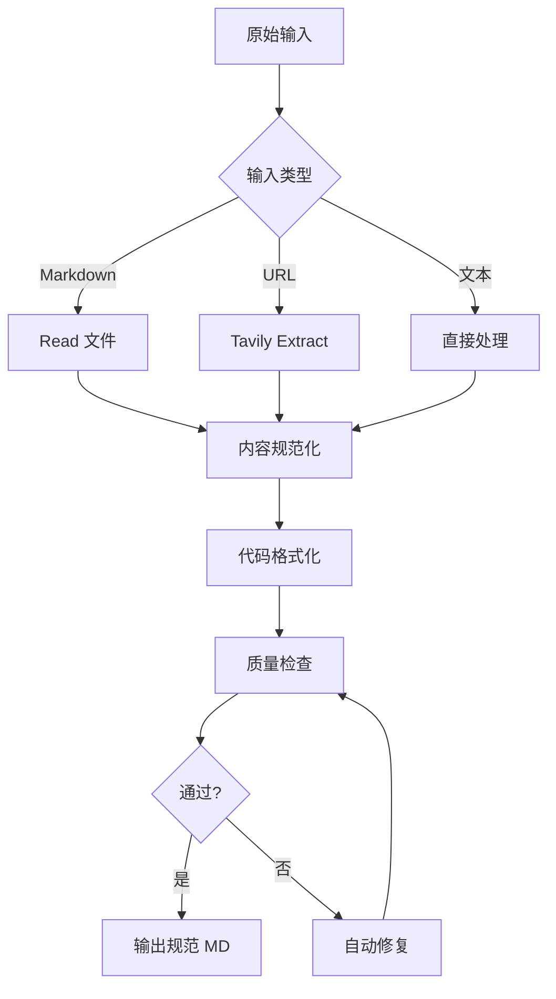
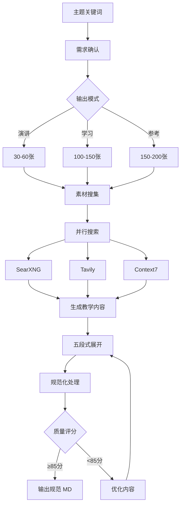

# 前链路规范化流程

**版本**: 1.0.0
**目的**: 将任意输入转换为符合 INPUT_SPEC.md 的规范 Markdown,供 md2ppt 渲染

---

## 核心职责

前链路负责:
1. ✅ 内容获取/生成
2. ✅ 格式规范化
3. ✅ 质量检查
4. ✅ 输出验证

**不负责**:
- ❌ Slidev 渲染 (后链路职责)
- ❌ 分页逻辑 (后链路职责)
- ❌ 主题样式 (后链路职责)

---

## 两种模式

### 模式 1: 转换模式 (Transform)

**触发**: 用户提供现有内容

**输入类型**:
- Markdown 文件 (`.md`)
- URL 链接
- 纯文本

**处理流程**:



**工具**: input2slides v2.0 CLI

```bash
node /Users/Apple/dev/skills/input2slides/cli/index-v2.js \
  input.md \
  --auto-format \
  --check-quality \
  --auto-fix \
  --max-line-width 100 \
  -o normalized.md
```

**输出保证**:
- ✅ UTF-8 编码
- ✅ 代码行宽 ≤100 字符
- ✅ 代码块有语言标识
- ✅ Frontmatter YAML 合法
- ✅ 标题层级连续

---

### 模式 2: 生成模式 (Generate)

**触发**: 用户提供主题关键词

**输入类型**:
- 主题名称
- 学习目标
- 受众水平

**处理流程**:



**工具**: make-ppt 教学设计流程

**关键步骤**:

1. **需求确认**:
```yaml
主题: TypeScript 教程
受众: 中级开发者
深度: 深入级
模式: 学习模式
预期: 100-150张
```

2. **素材搜集** (并行):
```bash
# 并行执行
SearXNG: "TypeScript 2025 tutorial"
Tavily: "TypeScript official docs"
Context7: "/microsoft/TypeScript"
```

3. **内容生成** (五段式):
```markdown
### 概念名称

---

### 💡 为什么需要?
[问题场景 + 痛点]

---

### ✅ 解决方案
[完整代码示例]

---

### 🔍 执行原理
[Mermaid 流程图 + 解析]

---

### 🎯 最佳实践
[对比 + 陷阱 + 修复]

---

### 🔧 实战建议
[场景 + 注意事项]
```

4. **规范化处理** (关键!):

**代码行宽检查**:
```python
def normalize_code_blocks(markdown):
    for block in extract_code_blocks(markdown):
        lines = block.split('\n')
        for i, line in enumerate(lines):
            if len(line) > 100:
                # 智能换行
                fixed_line = smart_break_line(line)
                lines[i] = fixed_line
        block = '\n'.join(lines)
    return markdown
```

**标题层级检查**:
```python
def validate_heading_hierarchy(markdown):
    headings = extract_headings(markdown)
    for i in range(len(headings)-1):
        current_level = headings[i].level
        next_level = headings[i+1].level
        if next_level > current_level + 1:
            raise ValueError(f"标题层级跳跃: H{current_level} → H{next_level}")
```

**Frontmatter 生成**:
```yaml
---
theme: default
background: '#ffffff'
class: text-center
highlighter: shiki
lineNumbers: false
drawings:
  persist: false
transition: slide-left
title: {主题标题}
---
```

5. **质量评分**:
```yaml
教学完整性 (40%): 38/40
内容深度 (30%):   28/30
实践价值 (20%):   19/20
视觉辅助 (10%):    9/10
总分: 94/100 ✅ 优秀
```

---

## 规范化检查清单

### 必须项 (MUST)

**文件格式**:
- [ ] UTF-8 编码
- [ ] LF 换行符
- [ ] 文件开头有 Frontmatter
- [ ] Frontmatter 与内容间空一行

**标题规范**:
- [ ] 使用 ATX 风格 (`# 标题`)
- [ ] 层级连续 (无跳跃)
- [ ] 同级标题 >1 个才作为章节

**代码块规范**:
- [ ] 所有代码块有语言标识
- [ ] 代码块正确闭合 (三个反引号)
- [ ] 代码行宽 ≤100 字符
- [ ] 超长行已智能换行

**Frontmatter 规范**:
- [ ] YAML 语法正确
- [ ] 仅包含 Slidev 官方字段
- [ ] 必需字段完整 (theme, title)

### 禁止项 (MUST NOT)

- [ ] 无 HTML 标签 (除 Slidev 指令)
- [ ] 无内联样式
- [ ] 无表格跨度语法
- [ ] 无脚注
- [ ] 无 TOC 指令
- [ ] 无编码非 UTF-8 字符

---

## 输出验证

**自动检查脚本**:

```bash
#!/bin/bash
# validate_output.sh

MD_FILE=$1

echo "🔍 检查文件编码..."
if ! file $MD_FILE | grep -q "UTF-8"; then
    echo "❌ 编码错误: 非 UTF-8"
    exit 1
fi

echo "🔍 检查换行符..."
if file $MD_FILE | grep -q "CRLF"; then
    echo "❌ 换行符错误: 使用 CRLF"
    exit 1
fi

echo "🔍 检查 Frontmatter..."
if ! head -1 $MD_FILE | grep -q "^---$"; then
    echo "❌ Frontmatter 缺失"
    exit 1
fi

echo "🔍 检查代码块..."
code_blocks=$(grep -c '```' $MD_FILE)
if [ $((code_blocks % 2)) -ne 0 ]; then
    echo "❌ 代码块未闭合"
    exit 1
fi

echo "🔍 检查代码行宽..."
while IFS= read -r line; do
    if [ ${#line} -gt 100 ]; then
        echo "⚠️  警告: 发现超长行 (${#line}字符)"
    fi
done < <(sed -n '/```/,/```/p' $MD_FILE | tail -n +2 | head -n -1)

echo "✅ 验证通过"
```

**使用方式**:
```bash
bash validate_output.sh normalized.md
```

---

## 工具集成

### input2slides v2.0 配置

**配置文件**: `.input2slidesrc.json`

```json
{
  "output": "normalized.md",
  "maxLineWidth": 100,
  "autoFormat": true,
  "checkQuality": true,
  "autoFix": true,
  "stats": true,
  "frontmatter": {
    "theme": "default",
    "highlighter": "shiki",
    "lineNumbers": false
  }
}
```

**执行命令**:
```bash
node index-v2.js input.md --config .input2slidesrc.json
```

---

### make-ppt 规范化模块

**新增模块**: `normalizer.js`

```javascript
// normalizer.js - 教学内容规范化

const CONFIG = {
  maxLineWidth: 100,
  encoding: 'utf-8',
  lineEnding: 'lf',
  headingStyle: 'atx'
};

/**
 * 规范化教学 Markdown
 */
function normalizeTeachingContent(markdown) {
  let normalized = markdown;

  // 1. 代码块处理
  normalized = normalizeCodeBlocks(normalized);

  // 2. 标题层级检查
  validateHeadingHierarchy(normalized);

  // 3. Frontmatter 生成
  normalized = ensureFrontmatter(normalized);

  // 4. 格式统一
  normalized = unifyFormat(normalized);

  return normalized;
}

/**
 * 代码块规范化
 */
function normalizeCodeBlocks(markdown) {
  const codeBlockRegex = /```(\w+)?\n([\s\S]*?)```/g;

  return markdown.replace(codeBlockRegex, (match, lang, code) => {
    // 确保语言标识
    if (!lang) {
      lang = detectLanguage(code);
    }

    // 行宽处理
    const lines = code.split('\n');
    const normalizedLines = lines.map(line => {
      if (line.length > CONFIG.maxLineWidth) {
        return smartBreakLine(line, lang);
      }
      return line;
    });

    return '```' + lang + '\n' + normalizedLines.join('\n') + '```';
  });
}

/**
 * 智能断行
 */
function smartBreakLine(line, lang) {
  // 根据语言特性智能换行
  if (lang === 'python') {
    return breakPythonLine(line);
  } else if (lang === 'javascript' || lang === 'typescript') {
    return breakJSLine(line);
  }
  // 默认在合适位置换行
  return defaultBreak(line);
}

/**
 * 标题层级验证
 */
function validateHeadingHierarchy(markdown) {
  const headings = [];
  const lines = markdown.split('\n');

  lines.forEach((line, index) => {
    const match = line.match(/^(#{1,6})\s+(.+)$/);
    if (match) {
      headings.push({
        level: match[1].length,
        text: match[2],
        line: index + 1
      });
    }
  });

  // 检查层级跳跃
  for (let i = 0; i < headings.length - 1; i++) {
    const current = headings[i].level;
    const next = headings[i + 1].level;
    if (next > current + 1) {
      throw new Error(
        `标题层级跳跃 (第${headings[i+1].line}行): H${current} → H${next}`
      );
    }
  }
}

/**
 * 确保 Frontmatter
 */
function ensureFrontmatter(markdown) {
  if (!markdown.startsWith('---\n')) {
    const frontmatter = `---
theme: default
highlighter: shiki
lineNumbers: false
title: 教学幻灯片
---

`;
    return frontmatter + markdown;
  }
  return markdown;
}

module.exports = {
  normalizeTeachingContent,
  normalizeCodeBlocks,
  validateHeadingHierarchy
};
```

**集成到 make-ppt**:

```javascript
// make-ppt 生成流程最后一步
const { normalizeTeachingContent } = require('./normalizer');

async function generateTutorial(topic, options) {
  // ... 教学内容生成 ...

  let markdown = generateMarkdownContent(content);

  // 规范化处理 (关键步骤!)
  markdown = normalizeTeachingContent(markdown);

  // 输出
  fs.writeFileSync('output/normalized.md', markdown, 'utf-8');

  return markdown;
}
```

---

## 完整工作流

### 转换模式示例

```bash
# 用户请求: "将 react-tutorial.md 转换为幻灯片"

# 前链路: 规范化
node input2slides/cli/index-v2.js react-tutorial.md \
  --auto-format \
  --check-quality \
  --auto-fix \
  --max-line-width 100 \
  -o normalized.md

# 验证输出
bash validate_output.sh normalized.md

# 后链路: 渲染
cd md2ppt
npm run build -- ../normalized.md --open
```

---

### 生成模式示例

```bash
# 用户请求: "生成 TypeScript 深度教程,学习模式"

# 前链路: 生成 + 规范化
# (在 make-ppt skill 中执行)
1. 需求确认 → 受众: 中级, 深度: 深入, 模式: 学习
2. 素材搜集 (并行) → SearXNG + Tavily + Context7
3. 内容生成 → 五段式 × 8章节 = 150张
4. 规范化处理 → normalizeTeachingContent()
5. 质量评分 → 94/100 ✅
6. 输出 → typescript-tutorial-normalized.md

# 验证输出
bash validate_output.sh typescript-tutorial-normalized.md

# 后链路: 渲染
cd md2ppt
npm run build -- ../typescript-tutorial-normalized.md --open
```

---

## 错误处理

### 常见问题

**问题 1: 代码行宽超限**

```
❌ 错误: 代码块第 23 行超过 100 字符 (实际: 145)
```

**解决**:
```javascript
// 自动修复
const longLine = "const result = someLongFunctionName(param1, param2, param3, param4, param5);";

// 智能断行
const fixed = `const result = someLongFunctionName(
  param1, param2, param3,
  param4, param5
);`;
```

---

**问题 2: 标题层级跳跃**

```
❌ 错误: 标题层级跳跃 (第 45 行): H2 → H4
```

**解决**:
```markdown
# ❌ 错误
## 章节标题
#### 子标题  ← 跳跃

# ✅ 修复
## 章节标题
### 子标题
```

---

**问题 3: 代码块未闭合**

```
❌ 错误: 代码块数量为奇数 (3个反引号标记)
```

**解决**:
```markdown
# ❌ 错误
```python
def hello():
    print("hi")
# 缺少闭合

# ✅ 修复
```python
def hello():
    print("hi")
```  ← 添加闭合
```

---

**问题 4: Frontmatter 格式错误**

```
❌ 错误: YAML 语法错误 (第 3 行)
```

**解决**:
```yaml
# ❌ 错误
---
theme: default
title: 测试  # 缺少引号
  subtitle: 副标题  # 缩进错误
---

# ✅ 修复
---
theme: default
title: "测试"
---
```

---

## 质量保证

### 输出质量标准

**Level 1: 基础合规** (必须)
- ✅ UTF-8 编码
- ✅ 代码行宽 ≤100
- ✅ Frontmatter 格式正确
- ✅ 标题层级连续

**Level 2: 内容质量** (生成模式)
- ✅ 教学完整性 ≥38/40
- ✅ 内容深度 ≥27/30
- ✅ 实践价值 ≥17/20
- ✅ 视觉辅助 ≥8/10

**Level 3: 用户体验** (后链路)
- ✅ 自动分页正确
- ✅ 代码高亮正常
- ✅ Mermaid 渲染正常
- ✅ 字体大小适中

---

## 总结

**前链路职责**:
1. 内容获取/生成
2. 格式规范化
3. 质量检查
4. 输出符合 INPUT_SPEC.md 的 Markdown

**后链路职责** (md2ppt):
1. 读取规范 Markdown
2. 智能分页
3. Slidev 渲染
4. 自动打开预览

**关键原则**:
- 前链路只管内容,不管渲染
- 后链路只管渲染,不管内容
- 中间用 INPUT_SPEC.md 解耦

---

**最后更新**: 2025-10-26
