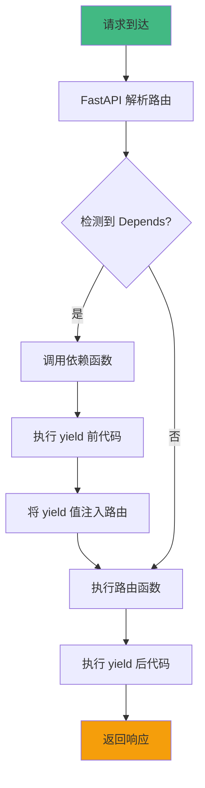
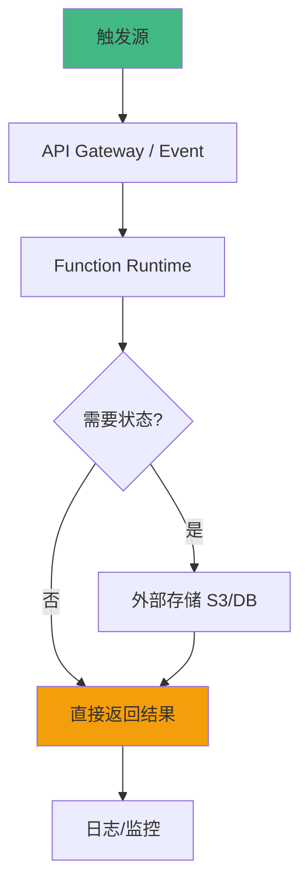

# Slides Generator 使用示例

本文档提供了 slides-generator skill 的实际使用示例。

---

## 示例 1: 教学场景 - 学习 FastAPI

**用户输入**:
```
"我想学习 FastAPI 的依赖注入机制,需要深入理解原理和最佳实践"
```

**AI 处理流程**:

```
[步骤 1] 🎯 场景识别
✅ 识别为: 教学场景
✅ 触发特征: "学习" + 库名 "FastAPI" + 技术概念 "依赖注入"
✅ 加载模板: templates/teaching.md

[步骤 2] 💬 需求确认
AI: "我注意到你想学习 FastAPI 的依赖注入。为了生成最适合的教程,请确认:
1. 你的 Python 和 Web 开发基础如何? (初学者/中级/高级)
2. 希望多深入? (快速了解/深入掌握/实战应用)"

用户: "中级,有 Flask 基础,希望深入掌握"

确认信息:
- 主题: FastAPI 依赖注入
- 受众: 中级 (有 Flask 基础)
- 深度: 深入掌握 (100-150张)

[步骤 3] 📚 素材搜集 (并行执行)
✅ Context7: 查询 /tiangolo/fastapi
   └─ 提取: Dependency Injection, Advanced User Guide, Tutorial
✅ SearXNG: "FastAPI dependency injection 2025 tutorial"
   └─ 找到 5 篇高质量教程
✅ Tavily: "FastAPI dependency injection best practices"
   └─ 找到官方最佳实践文档

📊 搜集到 8 篇高质量资料

[步骤 4] 🏗️ 内容架构设计
章节规划 (基于模板的五段式展开):
1. 基础依赖注入 (8张)
   - 💡 为什么需要依赖注入? (2张)
   - ✅ 如何使用 Depends? (3张)
   - 🔍 执行原理 (1张)
   - 🎯 最佳实践 (1张)
   - 🔧 实战建议 (1张)

2. 类依赖 (8张)
   └─ [五段式展开]

3. 子依赖 (7张)
   └─ [五段式展开]

4. 全局依赖 (6张)
   └─ [五段式展开]

5. 依赖覆盖 (7张)
   └─ [五段式展开]

预计总张数: 120-140 张

[步骤 5] ✍️ 生成内容 (完整示例片段)

---
theme: default
highlighter: shiki
lineNumbers: false
title: FastAPI 依赖注入完全指南
---

# FastAPI 依赖注入完全指南
## 从原理到实战

---

## 课程大纲

1. **基础依赖注入** - 理解核心概念
2. **类依赖** - 使用类作为依赖
3. **子依赖** - 依赖的依赖
4. **全局依赖** - 应用级依赖
5. **依赖覆盖** - 测试和调试

---

## 1.1 基础依赖注入

---

### 💡 为什么需要依赖注入?

**问题场景**: 多个路由需要共享逻辑 (如数据库连接, 认证检查)

```python
# ❌ 传统做法 - 代码重复
@app.get("/users")
def get_users():
    # 每个路由都要重复这段代码
    db = get_db_connection()
    try:
        users = db.query("SELECT * FROM users")
        return users
    finally:
        db.close()

@app.get("/posts")
def get_posts():
    # 又重复一遍
    db = get_db_connection()
    try:
        posts = db.query("SELECT * FROM posts")
        return posts
    finally:
        db.close()
```

**痛点**:
- ❌ 代码重复 - 每个路由都要写 get_db/close
- ❌ 容易出错 - 忘记 close 导致连接泄漏
- ❌ 难以测试 - 无法轻松替换数据库连接

---

### ✅ 解决方案: FastAPI 依赖注入

```python
# ✅ 使用依赖注入 - 解决代码重复
from fastapi import Depends

def get_db():
    """依赖函数 - 自动管理数据库连接"""
    db = Database()
    try:
        yield db  # 提供给路由使用
    finally:
        db.close()  # 自动清理

@app.get("/users")
def get_users(db = Depends(get_db)):
    # 只需声明依赖,FastAPI 自动注入
    return db.query("SELECT * FROM users")

@app.get("/posts")
def get_posts(db = Depends(get_db)):
    # 同样简洁
    return db.query("SELECT * FROM posts")
```

**核心优势**:
- 🎯 消除重复 - 共享逻辑只写一次
- 🔒 自动清理 - yield 后代码自动执行
- ⚡ 易于测试 - 可轻松替换依赖

---

### 🔍 执行原理详解



**关键步骤**:
1. **依赖收集**: FastAPI 扫描路由参数,识别 Depends
2. **依赖执行**: 按顺序执行依赖函数,收集返回值
3. **参数注入**: 将依赖返回值作为参数传给路由
4. **自动清理**: 路由执行完毕后,执行 yield 后的代码

---

### 🎯 最佳实践与陷阱

**✅ 推荐做法**:
```python
# ✅ 使用 yield 确保清理
def get_resource():
    resource = acquire()
    try:
        yield resource
    finally:
        resource.close()  # 无论如何都会执行
```

**❌ 常见错误 1**: 忘记使用 yield

```python
# ❌ 错误示例 - 无法自动清理
def get_db():
    db = Database()
    return db  # ← 问题: 永远不会 close
```

**问题**: 资源泄漏,数据库连接无法释放
**原因**: 没有使用 yield,FastAPI 无法在请求结束后执行清理
**修复**: 改用 yield

**❌ 常见错误 2**: 在依赖中使用 async 但不 await

```python
# ❌ 错误示例
async def get_db():
    return Database()  # ← 忘记 await 异步操作
```

**修复**: 确保 async 函数正确 await

---

### 🔧 实战建议

**适用场景**:
- ✅ 适合: 数据库连接, 认证检查, 日志记录
- ⚠️ 谨慎: 计算密集型操作 (可能阻塞)
- ❌ 避免: 简单的参数验证 (直接用 Pydantic)

**性能建议**:
- 💡 依赖会为每个请求执行,避免重复计算
- 💡 使用缓存依赖 (use_cache=True) 复用结果

**与其他概念的配合**:
- 中间件: 依赖更灵活,可针对特定路由
- 后台任务: 依赖可注入到后台任务

[... 后续章节继续展开 ...]

---

## 总结

**本课程覆盖**:
- ✅ 依赖注入核心原理
- ✅ 5 种依赖模式完整掌握
- ✅ 15+ 完整代码示例
- ✅ 实战最佳实践

**下一步学习**:
- 📚 FastAPI 中间件系统
- 🔧 FastAPI 数据库集成

[步骤 6] 🔧 规范化处理
✅ 代码行宽检查: 所有行 ≤100 字符
✅ 标题层级验证: H1→H2→H3, 无跳跃
✅ Frontmatter 生成: 包含 theme, highlighter, title
✅ 代码块语言标识: 所有代码块标记为 python
✅ 输出文件: fastapi-dependency-injection-teaching.md

[步骤 7] 📊 质量评分
- 教学完整性: 38/40 ⭐ (每个概念都有深入解释)
- 内容深度: 28/30 ⭐ (包含原理分析和流程图)
- 实践价值: 19/20 ⭐ (代码完整可运行)
- 视觉辅助: 9/10 ⭐ (Mermaid 流程图清晰)
✅ 总分: 94/100 (优秀)

[步骤 8] 🎬 调用 md2ppt
```bash
cd /Users/Apple/dev/md2ppt
npm run build -- fastapi-dependency-injection-teaching.md --open
```

✅ Slidev 已启动: http://localhost:30301

📊 最终结果:
- 文件: fastapi-dependency-injection-teaching.md
- 幻灯片数: 135 张
- 章节: 5 章
- 代码示例: 18 个
- 流程图: 3 个
- 预计学习时长: 2.5-3 小时
```

---

## 示例 2: 调研场景 - Serverless 架构分析

**用户输入**:
```
"调研 Serverless 架构,我们团队在考虑是否采用,需要全面了解优劣势和实际案例"
```

**AI 处理流程**:

```
[步骤 1] 🎯 场景识别
✅ 识别为: 调研场景
✅ 触发特征: "调研" + "架构" + "考虑是否采用"
✅ 加载模板: templates/research.md

[步骤 2] 💬 需求确认
AI: "了解到你在调研 Serverless 架构。请确认:
1. 调研目的? (技术选型/理论研究/趋势预测/方案对比)
2. 需要多深入? (概览级 30-50张 / 标准级 50-80张 / 深度级 80-120张)"

用户: "技术选型,需要标准级调研"

确认信息:
- 主题: Serverless 架构
- 目的: 技术选型
- 深度: 标准级 (50-80张)

[步骤 3] 📚 素材搜集 (并行执行)
✅ SearXNG: "Serverless 技术调研 2025"
   └─ 找到 AWS re:Invent 2024 报告, CNCF Serverless 白皮书
✅ Tavily: "Serverless industry report 2025"
   └─ 找到 Gartner Magic Quadrant, 多个企业案例
✅ WebFetch: ThoughtWorks Technology Radar
   └─ 提取 Serverless 相关评估和建议

📊 搜集到权威报告 6 篇, 企业案例 8 个

[步骤 4] 🏗️ 内容架构设计
基于模板的调研结构:
1. 背景与动机 (6张)
2. 技术现状 (12张)
3. 核心优势 (10张)
4. 局限性与挑战 (10张)
5. 应用案例 (12张) - 3个详细案例
6. 对比分析 (12张) - Serverless vs 传统/容器
7. 发展趋势 (8张)
8. 选型建议 (8张)

预计总张数: 78 张

[步骤 5] ✍️ 生成内容 (部分示例)

---
theme: default
highlighter: shiki
title: Serverless 架构调研分析报告
---

# Serverless 架构调研分析报告
## 全面分析与选型建议

---

## 调研大纲

1. **背景与动机** - 为什么关注 Serverless
2. **技术现状** - 当前发展情况
3. **核心优势** - 主要亮点
4. **局限性** - 存在的问题
5. **应用案例** - 3个真实案例深度分析
6. **对比分析** - vs 传统架构/容器化
7. **发展趋势** - 未来方向预测
8. **选型建议** - 决策矩阵和推荐

---

## 第一章: 背景与动机

---

### 1.1 技术背景

**行业痛点**:
- 传统服务器: 资源利用率低 (平均 10-15%)
- 容器化: 仍需管理集群, 运维负担重
- 业务发展: 流量波动大, 需要弹性伸缩

**Serverless 的出现**:
- 2014: AWS Lambda 发布, 开创 FaaS 先河
- 2018: Serverless Framework 生态成熟
- 2020-2024: 企业级应用快速增长

---

### 1.2 调研动机

**本次调研的目的**:
1. 评估 Serverless 是否适合我们的业务场景
2. 了解实际应用中的优势和挑战
3. 明确迁移成本和风险

**预期收益**: 为技术选型提供数据支撑的决策依据

---

## 第二章: 技术现状分析

---

### 2.1 核心概念

**Serverless 是什么?**

无服务器计算 (Serverless) 是一种云计算执行模型,开发者无需管理服务器基础设施,
代码按需执行,按实际使用付费。

**关键特征**:
- 事件驱动: 由事件触发函数执行
- 按需伸缩: 自动扩缩容,无需配置
- 按量计费: 仅为实际执行时间付费
- 无状态: 函数实例独立,不保存状态

---

### 2.2 技术架构



---

### 2.3 生态系统

| 类别 | 主要平台/工具 | 成熟度 |
|-----|-------------|-------|
| 云平台 | AWS Lambda, Azure Functions, GCP Cloud Functions | ⭐⭐⭐⭐⭐ |
| 开源框架 | OpenFaaS, Knative, Apache OpenWhisk | ⭐⭐⭐⭐ |
| 开发框架 | Serverless Framework, SAM, Chalice | ⭐⭐⭐⭐⭐ |
| 监控工具 | CloudWatch, Datadog, New Relic | ⭐⭐⭐⭐ |

---

### 2.4 采用情况

**市场数据** (来源: Datadog State of Serverless 2024):
- 采用率: 50%+ 云用户至少使用一项 Serverless 服务
- 增长率: 同比增长 28%

**主要采用者**:
- 大型企业: Netflix, Airbnb, Coca-Cola, Nordstrom
- 独角兽: Stripe, Instacart, Segment
- 中小企业: 快速增长, 尤其是创业公司

**地域分布**: 北美 45%, 欧洲 30%, 亚太 25%

[... 后续章节详细展开,包含案例、对比、趋势、建议 ...]

---

## 第八章: 选型建议

---

### 8.1 决策矩阵

**关键决策因素权重**:

| 因素 | 权重 | Serverless | 容器化 | 传统服务器 |
|-----|------|-----------|--------|----------|
| 运维成本 | 30% | 9 | 6 | 4 |
| 开发效率 | 25% | 8 | 7 | 5 |
| 成本控制 | 20% | 7 | 7 | 5 |
| 性能稳定性 | 15% | 6 | 8 | 9 |
| 技术成熟度 | 10% | 7 | 9 | 10 |
| **加权总分** | - | **7.7** | **7.1** | **6.1** |

---

### 8.2 推荐方案

**综合推荐**: 混合架构 (核心业务用容器, 边缘功能用 Serverless)

**推荐理由**:
1. 充分利用 Serverless 成本优势和弹性
2. 避免核心业务受冷启动影响
3. 降低迁移风险, 渐进式演进

**适用前提**:
- 团队有云服务使用经验
- 业务有明显的流量波动
- 可接受一定的架构复杂度

---

### 8.3 实施路线图

```mermaid
gantt
    title Serverless 迁移计划
    section 准备阶段
    团队培训             :2025-Q1, 1M
    POC 验证            :2025-Q1, 1M
    section 试点阶段
    非核心功能迁移        :2025-Q2, 2M
    监控和优化           :2025-Q2, 1M
    section 推广阶段
    批量迁移            :2025-Q3, 3M
    全面监控            :2025-Q3, ongoing
```

[步骤 6-8] 规范化、评分、渲染
[同教学示例流程]

📊 最终结果:
- 文件: serverless-architecture-research.md
- 幻灯片数: 78 张
- 真实案例: 3 个
- 对比维度: 8 个
- 决策矩阵: 1 个
```

---

## 示例 3: 算法场景 - LeetCode 题解

**用户输入**:
```
"LeetCode 二叉树中序遍历,需要多种解法对比"
```

**AI 处理流程**:

```
[场景识别] ✅ 算法场景
[模板加载] ✅ templates/algorithm.md
[需求确认] 学习目标: 单题精讲, 讲解深度: 深入分析

[素材搜集]
✅ SearXNG: "leetcode 94 binary tree inorder traversal solution"
✅ Tavily: "binary tree inorder traversal time complexity"

[内容生成] 按模板展开:
1. 问题描述 (3张)
2. 思路分析 - 3种解法演进 (6张)
3. 算法实现 - 递归/迭代/Morris (10张)
4. 复杂度分析 (4张)
5. 优化思路 (3张)
6. 变体题目 (5张)

总计: 31 张, 符合单题精讲规模
```

---

## 示例 4: 项目解析场景 - Vite 源码

**用户输入**:
```
"深入分析 Vite 的架构设计,特别是 HMR 机制"
```

**AI 处理流程**:

```
[场景识别] ✅ 项目解析场景
[模板加载] ✅ templates/project-analysis.md
[需求确认] 分析重点: 核心模块, 分析深度: 深入级

[素材搜集]
✅ GitHub: vite 仓库, 阅读 CONTRIBUTING.md
✅ Context7: /vitejs/vite 官方文档
✅ SearXNG: "vite architecture analysis hmr"

[内容生成] 按模板展开:
1. 项目简介 (6张)
2. 整体架构 (12张)
3. 核心模块 - HMR、Plugin、Dev Server (35张)
4. 设计模式 (12张)
5. 关键技术 (12张)
6. 最佳实践 (8张)

总计: 85 张, 符合深入级规模
```

---

## 总结

通过这些示例可以看到:

1. **智能识别**: AI 自动识别场景类型,加载对应模板
2. **主动确认**: 根据模板策略,主动向用户确认关键信息
3. **并行搜索**: 使用多个 MCP 工具并行搜集高质量资料
4. **结构化生成**: 严格按照模板策略展开内容
5. **质量保证**: 规范化输出并评分,确保符合标准
6. **统一渲染**: 最终都通过 md2ppt 渲染为 Slidev 幻灯片

**关键优势**:
- 🎯 场景化 - 不同场景使用不同策略
- 📊 数据驱动 - 搜集真实数据和案例
- ✅ 质量可控 - 评分机制保证输出质量
- 🚀 统一工具链 - md2ppt 统一渲染

---

**最后更新**: 2025-10-26
