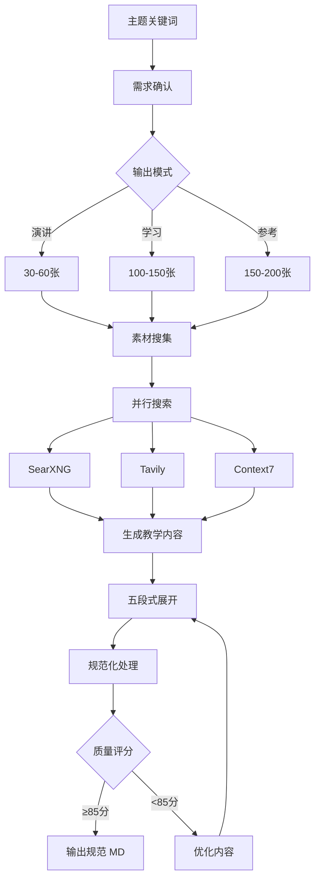

# 前链路规范化流程

**版本**: 1.1.0
**目的**: 将任意输入转换为符合 INPUT_SPEC 的规范 Markdown,供 md2ppt 渲染

**契约引用** (只读):
- **INPUT_SPEC**: `/Users/Apple/dev/md2ppt/INPUT_SPEC.md` - Markdown 格式规范
- **CLI_USAGE**: `/Users/Apple/dev/md2ppt/CLI_USAGE.md` - CLI 参数规范

**本文档职责**: 定义 skill 内部的内容处理策略,不重复 md2ppt 规范

---

## 核心职责

前链路负责:
1. ✅ 内容获取/生成
2. ✅ 格式规范化
3. ✅ 质量检查
4. ✅ 输出验证

**不负责**:
- ❌ Slidev 渲染 (后链路职责)
- ❌ 分页逻辑 (后链路职责)
- ❌ 主题样式 (后链路职责)

---

## 两种模式

### 模式 1: 转换模式 (Transform)

**触发**: 用户提供现有内容 (Markdown 文件/URL/纯文本)

**处理流程**:
1. 读取/提取输入内容
2. 快速目视检查 (代码块闭合、标题层级连续性)
3. 输出规范 Markdown

**容错策略**: 依赖 md2ppt 自动修复能力
- 缺失 Frontmatter → md2ppt 自动添加
- 标题层级问题 → md2ppt 容错处理
- 详见 INPUT_SPEC.md 规范

**调用方式**:
```bash
md2ppt input.md --open
# 参数详见 CLI_USAGE.md
```

---

### 模式 2: 生成模式 (Generate)

**触发**: 用户提供主题关键词

**输入类型**:
- 主题名称
- 学习目标
- 受众水平

**处理流程**:



**工具**: make-ppt 教学设计流程

**关键步骤**:

1. **需求确认**:
```yaml
主题: TypeScript 教程
受众: 中级开发者
深度: 深入级
模式: 学习模式
预期: 100-150张
```

2. **素材搜集** (并行):
```bash
# 并行执行
SearXNG: "TypeScript 2025 tutorial"
Tavily: "TypeScript official docs"
Context7: "/microsoft/TypeScript"
```

3. **内容生成** (五段式):
```markdown
### 概念名称

---

### 💡 为什么需要?
[问题场景 + 痛点]

---

### ✅ 解决方案
[完整代码示例]

---

### 🔍 执行原理
[Mermaid 流程图 + 解析]

---

### 🎯 最佳实践
[对比 + 陷阱 + 修复]

---

### 🔧 实战建议
[场景 + 注意事项]
```

**3.1 分批次生成策略** (大规模幻灯片):

**触发条件**: 预期输出 ≥80 张幻灯片

**必须流程**:

**步骤 1: 规划完整大纲**
```yaml
# 必须先完成整体规划
大纲结构:
  - 确定所有章节标题
  - 预估每章幻灯片数量
  - 计算总幻灯片数
  - 规划批次划分

示例:
章节1: TypeScript 基础类型 (18张)
章节2: 函数与接口 (22张)
章节3: 泛型系统 (20张)
章节4: 高级类型 (25张)
章节5: 装饰器 (18张)
章节6: 模块系统 (15张)
章节7: 实战案例 (20张)
章节8: 最佳实践 (12张)
总计: 150张 → 划分为 5 批次
```

**步骤 2: 分批次生成内容**

**批次划分原则**:
- ✅ 单批次文本长度 ≤2500 字符 (约 15-25 张幻灯片)
- ✅ 按章节边界划分,不拆分单个章节
- ✅ 每批次独立完整 (包含标题、代码、流程图)
- ✅ 批次间保持连贯性

**批次示例**:
```yaml
批次1 (章节1+2):
  - 内容: 基础类型 + 函数与接口
  - 预计: ~2400 字符, 40 张幻灯片
  - 文件: part1-basics.md

批次2 (章节3):
  - 内容: 泛型系统
  - 预计: ~2200 字符, 20 张幻灯片
  - 文件: part2-generics.md

批次3 (章节4):
  - 内容: 高级类型
  - 预计: ~2500 字符, 25 张幻灯片
  - 文件: part3-advanced-types.md

批次4 (章节5+6):
  - 内容: 装饰器 + 模块系统
  - 预计: ~2300 字符, 33 张幻灯片
  - 文件: part4-decorators-modules.md

批次5 (章节7+8):
  - 内容: 实战案例 + 最佳实践
  - 预计: ~2400 字符, 32 张幻灯片
  - 文件: part5-practice.md
```

**步骤 3: 批次质量控制**

每批次生成后必须检查:
```yaml
内容完整性:
  - [ ] 章节标题完整
  - [ ] 五段式展开完整
  - [ ] 代码示例可运行
  - [ ] 流程图正确渲染

格式规范:
  - [ ] 代码行宽 ≤100 字符
  - [ ] 标题层级连续
  - [ ] 代码块有语言标识
  - [ ] Markdown 语法正确

批次衔接:
  - [ ] 与大纲一致
  - [ ] 与前后批次连贯
  - [ ] 无重复内容
```

**步骤 4: 合并与最终规范化**

```bash
# 合并所有批次
cat part1-basics.md \
    part2-generics.md \
    part3-advanced-types.md \
    part4-decorators-modules.md \
    part5-practice.md > merged.md

# 添加 Frontmatter (如果缺失)
echo "---
theme: default
highlighter: shiki
lineNumbers: false
title: TypeScript 完全指南
---

" | cat - merged.md > final.md

# 执行最终规范化检查
```

**关键优势**:
- ✅ **避免 Token 限制**: 单批次文本量可控
- ✅ **质量稳定**: 每批次都能保持高质量
- ✅ **错误恢复**: 出错只需重新生成单个批次
- ✅ **进度可见**: 用户可以看到生成进度

4. **规范化处理**: 确保输出符合 INPUT_SPEC.md 规范

5. **质量评分**:
```yaml
教学完整性 (40%): 38/40
内容深度 (30%):   28/30
实践价值 (20%):   19/20
视觉辅助 (10%):    9/10
总分: 94/100 ✅ 优秀
```

---

## 输出规范引用

**格式规范**: 参见 INPUT_SPEC.md 的完整定义
- 文件格式要求 (UTF-8, LF, Frontmatter)
- 标题规范 (ATX 风格、层级连续性)
- 代码块规范 (语言标识、闭合、行宽)
- 分页规范 (避免连续 `---`、H1/H2/H3 层次)

**CLI 调用**: 参见 CLI_USAGE.md 的完整文档
```bash
md2ppt input.md --open
# 详见 CLI_USAGE.md
```

---

## 完整工作流

### 转换模式示例

```bash
# 用户: "将 react-tutorial.md 转换为幻灯片"
Read react-tutorial.md → md2ppt react-tutorial.md --open
```

### 生成模式示例

```bash
# 用户: "生成 TypeScript 深度教程,学习模式"
素材搜集 (并行) → 五段式生成 (分批次) → 规范化 → 质量评分 → 输出 MD → md2ppt 渲染
```

---

## 质量标准

### Skill 内部质量控制 (前链路)

**Level 1: 格式合规**
- 符合 INPUT_SPEC.md 所有必须项

**Level 2: 内容质量** (生成模式)
- 教学完整性 ≥38/40
- 内容深度 ≥27/30
- 实践价值 ≥17/20
- 视觉辅助 ≥8/10

---

## 职责总结

**前链路 (本 skill)**:
1. 内容获取/生成
2. 格式规范化
3. 输出符合 INPUT_SPEC 的 Markdown

**后链路 (md2ppt)**:
1. 智能分页
2. Slidev 渲染
3. 自动预览

**解耦原则**: 中间用 INPUT_SPEC.md + CLI_USAGE.md 作为契约

---

**版本**: 1.1.0 | **更新**: 2025-10-26
