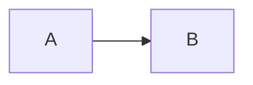

# 验证工作流程

> 如何使用验证脚本并处理验证反馈

## 基本用法

### 运行验证

```bash
./scripts/validate-slides.sh ~/note-vsc/slides/your-slides.md
```

### 理解输出

验证脚本会输出 3 种结果:

**✅ 通过 (绿色)**
```
✓ 所有代码块都有语言标识
✓ 包含 theme 配置: seriph
```

**❌ 失败 (红色)**
```
✗ 发现 6 个无语言标识的代码块
  → 代码块必须指定语言: ```typescript 或 ```text
```

**⚠️ 警告 (黄色)**
```
⚠ 发现 2 处分隔符前后缺少空行
  → --- 前后应有空行
```

## 常见问题修复

### 1. 代码块缺少语言标识

**错误示例**:
````markdown
```
code here
```
````

**修复方法**:
````markdown
```typescript
code here
```
````

**或者对于纯文本**:
````markdown
```text
plain text here
```
````

### 2. 分隔符前后缺少空行

**错误示例**:
```markdown
内容
---
## 标题
```

**修复方法**:
```markdown
内容

---

## 标题
```

### 3. 缺少必需的 Frontmatter 字段

**错误示例**:
```yaml
---
title: 演示
---
```

**修复方法**:
```yaml
---
theme: seriph
title: 演示
---
```

### 4. Mermaid 图表缺少 scale 参数

**错误示例**:
````markdown

````

**修复方法**:
````markdown

````

### 5. 内容溢出未处理

**警告提示**:
```
⚠ 2 个页面可能需要溢出处理
  → 考虑添加 class: overflow-y-auto 或 zoom
```

**修复方法 (优先级)**:

**方案 1: 启用滚动** (推荐)
```yaml
---
class: overflow-y-auto
---

## 页面内容
大量内容...
```

**方案 2: 内容缩放** (兜底)
```yaml
---
zoom: 0.85
---

## 页面内容
```

**方案 3: 内容拆分** (最佳)
```markdown
---

## 部分 1
内容...

---

## 部分 2
更多内容...
```

## 集成到生成流程

### Agent 工作流

1. **生成幻灯片**
   - 按照模板生成 Markdown
   - 保存到 `~/note-vsc/slides/`

2. **运行验证**
   ```bash
   ./scripts/validate-slides.sh ~/note-vsc/slides/生成的文件.md
   ```

3. **处理结果**
   - **所有检查通过** (0 失败): 继续打开预览
   - **有失败项目**: 根据提示修复,重新验证
   - **只有警告**: 记录建议,可选修复

4. **重新验证**
   - 修复后再次运行验证
   - 确保所有失败项变为通过

5. **打开预览**
   ```bash
   cd ~/note-vsc/slides && slidev 文件名.md --open
   ```

### 验证结果判断

```bash
exit_code=$?
if [ $exit_code -eq 0 ]; then
  echo "验证通过,打开预览"
  cd ~/note-vsc/slides && slidev filename.md --open
else
  echo "验证失败,需要修复"
  # 查看详细错误并修复
fi
```

## 验证检查项详解

### [1/7] 文件格式检查
- UTF-8 编码
- LF 换行符 (不是 CRLF)

### [2/7] Frontmatter 配置检查
- 存在 headmatter (开头的 --- 块)
- 包含 `theme` 字段
- 包含 `title` 字段
- 推荐包含 `fonts` 配置

### [3/7] 分页规则检查
- 使用 `---` 分隔幻灯片
- `---` 前后必须有空行
- 统计总幻灯片数量

### [4/7] 代码块规范检查
- 所有代码块必须有语言标识
- 统计有/无语言标识的代码块数量

### [5/7] Mermaid 图表检查
- 统计 Mermaid 图表数量
- 检查是否设置 `scale` 参数
- 推荐 `{scale: 0.7-0.8}`

### [6/7] 内容溢出防止检查
- 检测启用滚动的页面数量
- 检测使用缩放的页面数量
- 警告可能需要处理的页面

### [7/7] 内容质量检查
- 检测空白幻灯片
- 统计使用 `##` 标题的数量

## 性能考虑

验证脚本在大文件上的性能:
- 100 页: < 1秒
- 200 页: < 2秒
- 500 页: < 5秒

对生成流程的影响极小。

## 脚本维护

脚本位置: `scripts/validate-slides.sh`

如需修改检查规则:
1. 编辑脚本中对应的检查部分
2. 更新 `validation-checklist.md`
3. 测试新规则

## 参考

- 核心规则: @references/specs/slidev-core-rules.md
- 检查清单: @references/specs/validation-checklist.md
- 快速参考: @references/guides/slidev-quickref.md
