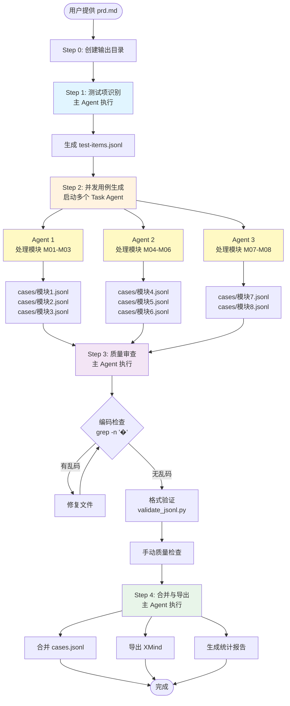
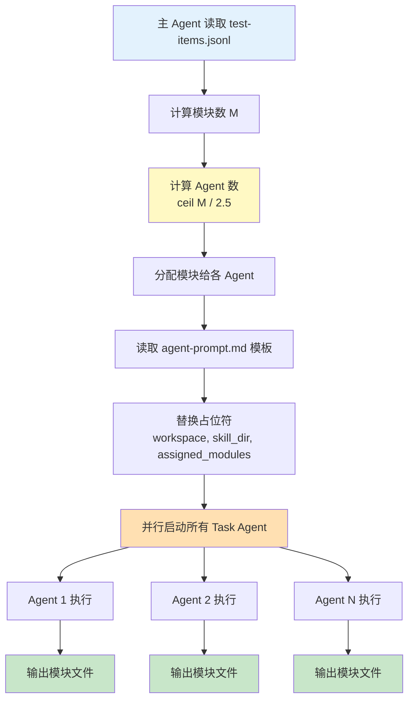
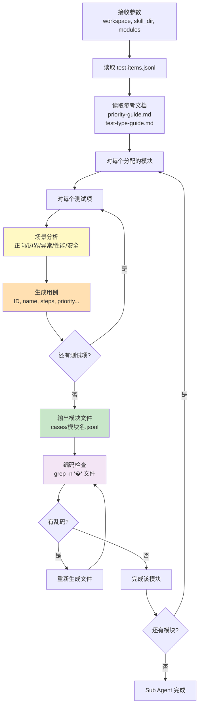
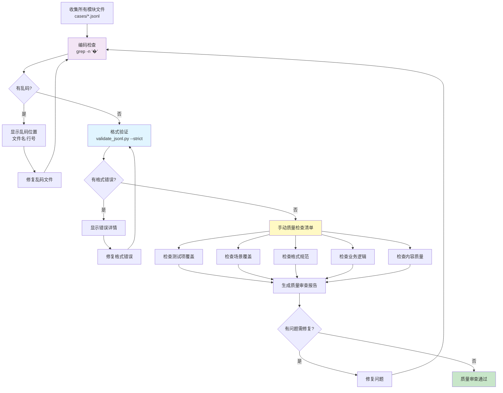
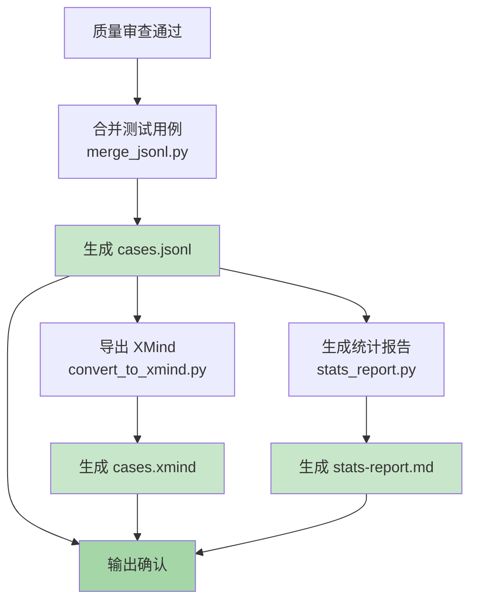
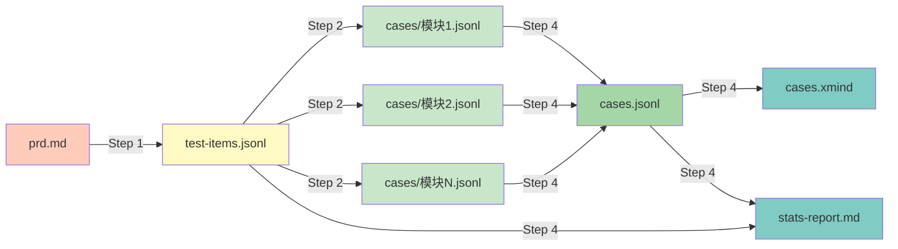
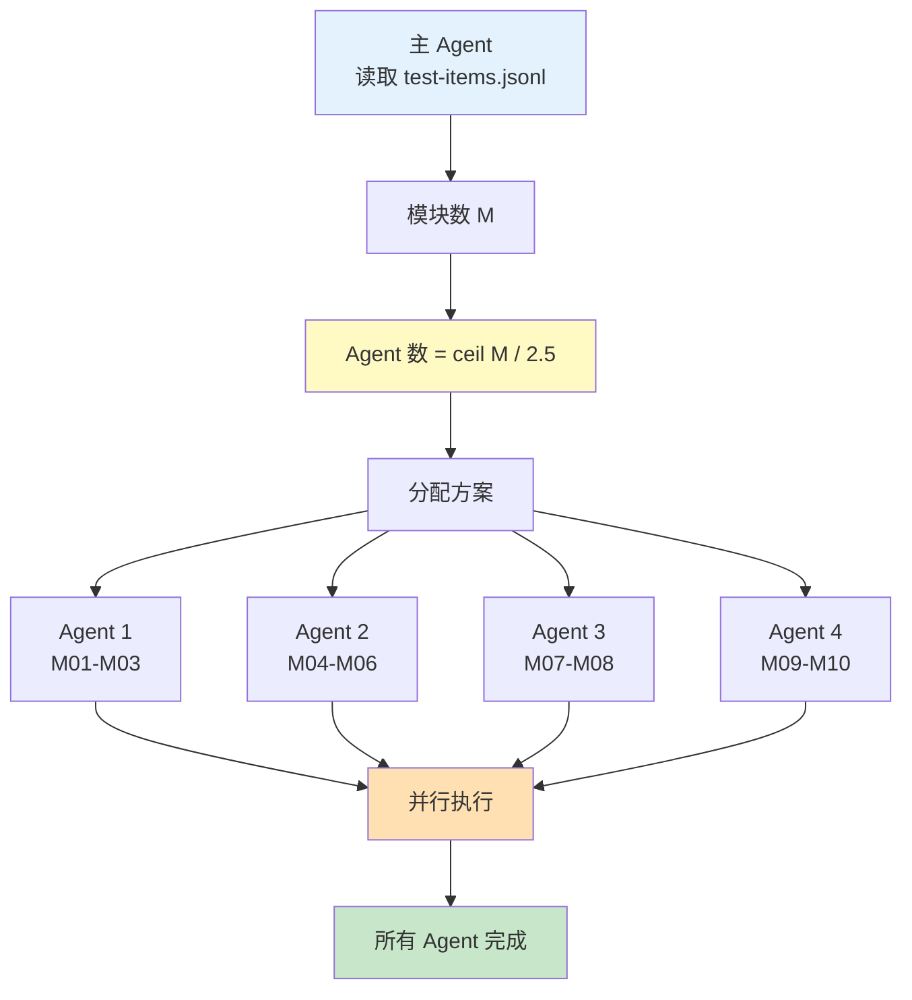
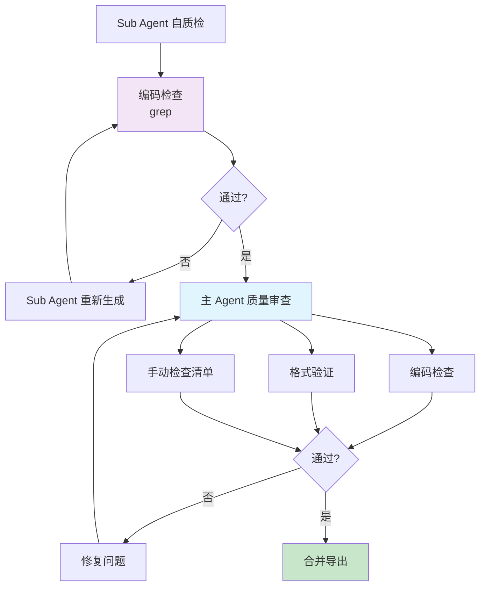

# 测试用例生成器 - 完整工作流逻辑

## 概览

本文档详细描述测试用例生成器的完整工作流逻辑，包括角色分工、数据流转、并发策略和质量保证机制。

## 核心设计理念

### 1. 轻量级测试项识别 + 重量级用例生成

```
快速识别（单线程）   →   并发生成（多线程）
   测试项列表              完整测试用例
   (轻量级)                (重量级)
```

**优势**：
- 快速获得并发分配基准（测试项列表）
- 避免重复解析需求文档
- 场景分析和用例生成可以并发执行
- 每个 Sub Agent 有完整的业务上下文（prd 内容）

### 2. 模块前缀 ID 方案

```
模块 M01: M01-001, M01-002, M01-003...
模块 M02: M02-001, M02-002, M02-003...
模块 M03: M03-001, M03-002, M03-003...
```

**优势**：
- 天然无冲突（每个模块独立编号空间）
- 无需预分配 ID 段
- ID 即表明所属模块
- 支持无限扩展（M01-999 内可容纳 999 个用例）

### 3. 执行控制明确化

```
主 Agent 职责：
- Step 0: 创建输出目录
- Step 1: 测试项识别
- Step 3: 质量审查
- Step 4: 合并导出

Task Agent 职责：
- Step 2: 并发用例生成（每个 agent 负责 2-3 个模块）
```

**优势**：
- 防止主 Agent 过度委托
- 确保关键步骤不被跳过
- 并发仅用于耗时的用例生成阶段

---

## 完整工作流

### 整体流程图



---

## 详细步骤说明

### Step 0: 创建输出目录

**执行者**：主 Agent

**输入**：
- prd.md 文件路径（如 `/path/to/Polaris 差旅报销中台.md`）

**处理**：
1. 提取需求名称（去掉 .md 后缀）
2. 在同级目录创建需求目录

**输出**：
- 工作区目录（如 `/path/to/Polaris 差旅报销中台/`）

**示例**：
```
输入：/path/to/Polaris 差旅报销中台.md
输出：/path/to/Polaris 差旅报销中台/（新建目录）
```

---

### Step 1: 测试项识别（轻量级）

**执行者**：主 Agent（不可委托给 Task Agent）


**输入**：
- `prd.md`（需求文档）

**处理逻辑**：

1. **识别功能模块**：按章节/功能点划分
   ```
   识别规则：
   - 每个用户可执行的操作 = 1 个测试项
   - 每个系统自动行为 = 1 个测试项
   - 每个 CRUD 操作 = 1 个测试项
   - 每个关键业务规则 = 1 个测试项
   ```

2. **评估业务价值**：
   - **高**：核心业务流程（登录、支付、下单）
   - **中**：辅助功能（信息修改、查询）
   - **低**：边缘功能（高级设置、管理员功能）

3. **分配 module_id**：
   - 格式：M01, M02, M03... M99（最多 99 个模块）
   - 按识别顺序递增
   - 用于后续用例 ID 前缀

4. **提取模块 prd**：
   - 提取该模块相关的需求章节内容
   - 供 Sub Agent 理解业务上下文

**输出**：`{workspace}/test-items.jsonl`

**Schema**：
```typescript
interface ModuleTestItems {
  module_id: string;           // M01, M02, M03...
  module_name: string;         // ≤15 字符
  test_items: Array<{
    item: string;              // 测试项名称
    business_value: "高" | "中" | "低";
  }>;
  prd: string;                 // 该模块的完整需求内容
}
```

**示例**：
```jsonl
{"module_id":"M01","module_name":"用户登录","test_items":[{"item":"用户登录流程","business_value":"高"},{"item":"密码找回","business_value":"中"}],"prd":"## 用户登录\n支持用户名、手机号、邮箱三种方式登录..."}
{"module_id":"M02","module_name":"订单管理","test_items":[{"item":"订单创建","business_value":"高"},{"item":"订单查询","business_value":"中"}],"prd":"## 订单管理\n用户可以创建订单..."}
```

**关键原则**：
- ⚡ 快速识别（不做场景分析）
- 📋 粒度适中（每个测试项预估 3-8 条用例）
- 🎯 面向并发（按模块分组）

---

### Step 2: 场景分析 + 用例生成（重量级，并发）

**执行者**：多个 Task Agent（主 Agent 启动并协调）



#### 2.1 主 Agent 的职责

**并发数计算**：
```python
M = len(modules)  # 模块总数
agent_count = ceil(M / 2.5)  # 每个 agent 负责 2-3 个模块

示例：
- 5 个模块 → 2 个 agent
- 8 个模块 → 4 个 agent
- 10 个模块 → 4 个 agent
```

**模块分配**：
- 顺序分配（不做负载均衡）
- 示例：10 个模块 → Agent1(M01-M03), Agent2(M04-M06), Agent3(M07-M08), Agent4(M09-M10)

**启动 Sub Agent**：
1. 读取 `{skill_dir}/assets/agent-prompt.md`
2. 替换占位符：
   - `{workspace}` → 需求输出目录的绝对路径
   - `{skill_dir}` → test-case-generator skill 目录的绝对路径
   - `{assigned_modules}` → 分配给该 agent 的模块列表（JSON）
3. 使用 Task 工具并行启动所有 agent

#### 2.2 Sub Agent 的执行流程



**Sub Agent 输入**：
- `workspace`：需求输出目录绝对路径
- `skill_dir`：skill 目录绝对路径
- `assigned_modules`：分配的模块列表

**Sub Agent 处理**：

1. **读取文件**：
   - `{workspace}/test-items.jsonl` - 获取测试项
   - `{skill_dir}/references/priority-guide.md` - 优先级规则
   - `{skill_dir}/references/test-type-guide.md` - 测试类型规则
   - `{skill_dir}/assets/case-template.jsonl` - 用例格式参考

2. **场景分析**（每个测试项）：
   - **正向场景**：正常流程，合法输入
   - **边界场景**：边界值（最大/最小/空值）
   - **异常场景**：错误输入、失败处理
   - **性能场景**：并发、大数据量（如需求有要求）
   - **安全场景**：认证、授权、注入攻击（如涉及敏感操作）

3. **场景覆盖策略**：
   - 所有测试项：至少 1 个正向 + 1 个异常/边界
   - 核心功能（business_value=高）：覆盖更多场景类型
   - 辅助功能（business_value=中）：正向 + 边界 + 异常
   - 边缘功能（business_value=低）：正向 + 异常

4. **用例生成**：
   - ID 格式：`{module_id}-{seq:03d}`（如 M01-001）
   - 每个模块独立编号（001, 002, 003...）
   - 优先级：参考 priority-guide.md
   - 测试类型：参考 test-type-guide.md
   - 步骤描述：具体可执行，避免模糊描述

5. **输出文件**：
   - 路径：`{workspace}/cases/{module_name}.jsonl`
   - 格式：每行一条用例（JSONL）

6. **编码检查**（每个模块生成后立即执行）：
   ```bash
   grep -n '�' {workspace}/cases/{module_name}.jsonl
   ```
   - 无输出 = 无乱码，继续
   - 有输出 = 发现乱码，重新生成

**输出**：`{workspace}/cases/{module_name}.jsonl`（多个文件）

**Schema**：
```typescript
interface TestCase {
  id: string;                  // M01-001, M01-002...
  name: string;                // 主谓宾格式，以"验证"开头
  module_name: string;         // ≤15 字符
  test_item: string;           // 所属测试项
  scenario_type: string;       // 正向/边界/异常/性能/安全场景
  priority: "P1" | "P2" | "P3" | "P4" | "P5";
  test_type: string;           // 13 种测试类型之一
  is_negative: boolean;        // 异常/边界=true
  preconditions: string[];     // 前置条件
  steps: Array<{
    action: string;            // 具体操作
    expected: string;          // 可验证结果
  }>;
  notes?: string;              // 备注（可选）
}
```

**ID 编号规则**：
```
模块 M01: M01-001, M01-002, M01-003...
模块 M02: M02-001, M02-002, M02-003...
模块 M03: M03-001, M03-002, M03-003...

特点：
- 每个模块独立编号空间
- 天然无冲突
- 无需预分配 ID 段
```

---

### Step 3: 质量审查

**执行者**：主 Agent（不可委托给 Task Agent）



#### 3.1 编码检查（优先执行）

**命令**：
```bash
grep -n '�' {workspace}/cases/*.jsonl
```

**判断规则**：
- **无输出** = 无乱码，通过
- **有输出** = 显示 `文件名:行号:内容`，必须先修复

**示例**：
```bash
# 有乱码的情况
$ grep -n '�' cases/用户登录.jsonl
3:{"id":"M01-003","name":"验证用户�功登录",...}
5:{"id":"M01-005","steps":[{"action":"点击按钮","expected":"登录成�"}]...}

# 无乱码的情况（无输出）
$ grep -n '�' cases/用户登录.jsonl
$
```

#### 3.2 格式验证（使用脚本）

**命令**：
```bash
cd {skill_dir}
python scripts/validate_jsonl.py {workspace}/cases/*.jsonl --strict
```

**验证内容**：
- JSON 语法验证
- Schema 验证（test-case.schema.json）
- 业务规则验证：
  - ID 唯一性
  - ID 格式（M01-001）
  - scenario_type 有效值
  - steps 格式
  - module_name 长度

**输出**：
```
✅ 用户登录.jsonl: 8 条记录，无错误
⚠️  订单管理.jsonl: 12 条记录，2 个警告
❌ 支付功能.jsonl: 5 条记录，3 个错误
```

#### 3.3 手动质量检查清单

**1. 测试项覆盖检查**
- [ ] 列出 test-items.jsonl 中所有测试项
- [ ] 检查每个测试项是否有对应用例
- [ ] 计算覆盖率 = 已覆盖测试项数 / 总测试项数
- [ ] 目标：100% 覆盖

**2. 场景覆盖检查**
- [ ] 每个测试项至少 1 个正向场景
- [ ] 每个测试项至少 1 个异常/边界场景
- [ ] 核心功能覆盖更多场景类型

**3. 格式规范检查**
- [ ] 用例名称以"验证"开头（主谓宾格式）
- [ ] module_name ≤15 字符
- [ ] test_item 与 test-items.jsonl 中的 item 匹配
- [ ] scenario_type 为有效值
- [ ] steps 至少有 1 条，每条有 action 和 expected
- [ ] preconditions 为数组格式

**4. 业务逻辑检查**
- [ ] 优先级合理（P1 占比 10-20%）
- [ ] 反向用例标记 is_negative: true
- [ ] test_type 与 scenario_type 匹配

**5. 内容质量检查**
- [ ] 步骤描述具体可执行（避免"正确操作"等模糊描述）
- [ ] 预期结果可验证（避免"正常"等模糊描述）
- [ ] 前置条件完整

**输出**：质量审查报告

```markdown
## 质量审查报告

- 总用例数：156
- 测试项覆盖率：100%（42/42）
- 场景覆盖：正向 42 个，异常 52 个，边界 38 个，性能 12 个，安全 12 个
- 格式问题：0 处
- 优先级分布：P1(12%) P2(30%) P3(28%) P4(22%) P5(8%)
- 反向用例占比：18%

### 待修复问题
无
```

---

### Step 4: 合并与导出

**执行者**：主 Agent（不可委托给 Task Agent）



#### 4.1 合并测试用例

**命令**：
```bash
cd {skill_dir}
python scripts/merge_jsonl.py {workspace}/cases/*.jsonl -o {workspace}/cases.jsonl --sort-by module
```

**处理**：
- 读取所有模块文件
- 按模块排序（M01, M02, M03...）
- 合并为单个 JSONL 文件

**输出**：`{workspace}/cases.jsonl`

#### 4.2 导出 XMind 思维导图（可选）

**命令**：
```bash
cd {skill_dir}
python scripts/convert_to_xmind.py {workspace}/cases.jsonl -o {workspace}/cases.xmind --name "{需求名称}"
```

**结构**：
```
{需求名称}
├─ 模块 1
│  ├─ 测试项 1.1
│  │  ├─ [P1] 验证用例 1
│  │  └─ [P3] 验证用例 2
│  └─ 测试项 1.2
│     └─ [P2] 验证用例 3
├─ 模块 2
│  └─ ...
```

**输出**：`{workspace}/cases.xmind`

#### 4.3 生成统计报告

**命令**：
```bash
cd {skill_dir}
python scripts/stats_report.py {workspace}/cases.jsonl --test-items {workspace}/test-items.jsonl -o {workspace}/stats-report.md
```

**内容**：
- 总体统计（模块数、测试项数、用例数）
- 优先级分布
- 测试类型分布
- 场景类型分布
- 模块明细

**输出**：`{workspace}/stats-report.md`

#### 4.4 输出确认

```markdown
## 导出完成

已生成以下文件：
- test-items.jsonl（42 个测试项）
- cases/（8 个模块文件，中间态）
- cases.jsonl（156 条用例，合并后）
- cases.xmind（思维导图）
- stats-report.md（统计报告）

请查收。
```

---

## 数据流转

### 数据流向图



### 目录结构

```
/path/to/
├── Polaris 差旅报销中台.md      # 需求文档（输入）
└── Polaris 差旅报销中台/         # 输出目录（Step 0 创建）
    ├── test-items.jsonl          # 测试项（Step 1）
    ├── cases/                    # 模块用例（Step 2，中间态）
    │   ├── 用户登录.jsonl
    │   ├── 订单管理.jsonl
    │   ├── 支付功能.jsonl
    │   └── ...
    ├── cases.jsonl               # 合并用例（Step 4）
    ├── cases.xmind               # XMind 导图（Step 4，可选）
    └── stats-report.md           # 统计报告（Step 4）
```

---

## 并发策略

### 并发模型



### 并发计算公式

```python
agent_count = ceil(M / 2.5)
# 每个 agent 负责 2-3 个模块

示例：
M = 5  → agent_count = 2  → 每个 2-3 个模块
M = 8  → agent_count = 4  → 每个 2 个模块
M = 10 → agent_count = 4  → 每个 2-3 个模块
```

### 模块分配策略

**顺序分配**（不做负载均衡）：
```python
示例：10 个模块，4 个 agent

Agent 1: M01, M02, M03
Agent 2: M04, M05, M06
Agent 3: M07, M08
Agent 4: M09, M10
```

**优势**：
- 简单直接，无需预估工作量
- 模块独立编号，天然无冲突
- 某个 agent 失败只影响部分模块

---

## 质量保证

### 质量保证机制



### 质量阈值

| 指标 | 目标值 | 说明 |
|-----|-------|-----|
| 测试项覆盖率 | 100% | 所有测试项都有用例 |
| 场景覆盖 | 每项至少 2 种场景 | 至少 1 正向 + 1 异常/边界 |
| P1 用例占比 | 10-20% | 核心功能正向场景 |
| 反向用例占比 | ≥15% | 异常/边界场景 |
| 格式错误数 | 0 | validate_jsonl.py --strict |
| ID 冲突数 | 0 | 每个 ID 全局唯一 |
| 乱码字符数 | 0 | grep -n '�' 无输出 |

### 优先级分布建议

| 优先级 | 建议占比 | 说明 |
|-------|---------|-----|
| P1 | 10-20% | 核心功能正向场景 |
| P2 | 25-35% | 基本功能正向场景 |
| P3 | 20-30% | 核心功能反向场景 |
| P4 | 15-25% | 基本功能反向场景 |
| P5 | 5-10% | 不常用功能 |

---

## 错误处理

### 常见问题与解决方案

| 问题 | 原因 | 解决方案 |
|-----|-----|---------|
| 相对路径失败 | working directory 不是 skill 目录 | 使用绝对路径，或 cd 到 skill 目录 |
| 乱码字符 | 编码处理错误 | Sub Agent 重新生成文件 |
| ID 格式错误 | 未遵循 M01-001 格式 | validate_jsonl.py 会捕获 |
| scenario_type 无效 | 未使用 5 种有效值 | validate_jsonl.py 会捕获 |
| 测试项遗漏 | Sub Agent 未生成某些测试项用例 | 手动检查清单会发现 |
| 模糊描述 | action/expected 不够具体 | 手动检查清单发现后修复 |

### 故障恢复

**如果某个 Sub Agent 失败**：
1. 检查该 agent 负责的模块
2. 手动修复或重新启动该 agent
3. 其他模块不受影响（独立编号空间）

**如果发现 ID 冲突**（理论上不应发生）：
1. 检查是否有两个模块使用了相同的 module_id
2. 修正 test-items.jsonl 中的 module_id
3. 重新生成受影响模块的用例

---

## 成功标准

### 交付物完整性

- [ ] `test-items.jsonl` - 测试项列表
- [ ] `cases/` - 各模块用例文件（中间态）
- [ ] `cases.jsonl` - 合并后的所有用例
- [ ] `cases.xmind` - XMind 思维导图（可选）
- [ ] `stats-report.md` - 统计报告

### 质量标准

- [ ] 测试项覆盖率 = 100%
- [ ] 每个测试项至少 1 个正向场景
- [ ] 每个测试项至少 1 个异常/边界场景
- [ ] `validate_jsonl.py --strict` 0 错误
- [ ] `grep -n '�' cases/*.jsonl` 无输出
- [ ] 用例名称以"验证"开头
- [ ] 优先级分布符合建议范围
- [ ] 反向用例占比 ≥15%

---

## 关键优化点

### 1. 路径处理（已优化）

**问题**：原设计使用相对路径，容易失败

**解决方案**：
- agent-prompt.md 使用 `{skill_dir}` 占位符
- SKILL.md 明确路径处理方式
- 主 Agent 传递绝对路径给 Sub Agent

### 2. 执行控制（已优化）

**问题**：AI 可能把整个流程委托给单个 Task Agent

**解决方案**：
- 明确禁止整体委托
- 明确只有 Step 2 使用 Task Agent
- 主 Agent 必须执行 Step 0, 1, 3, 4

### 3. 编码检查（已优化）

**问题**：生成的文件可能有乱码

**解决方案**：
- 使用简单的 grep 命令检查
- Sub Agent 生成后立即自检
- 主 Agent 在质量审查阶段再次检查

### 4. ID 方案（已优化）

**问题**：全局递增 ID 容易冲突

**解决方案**：
- 使用模块前缀 ID（M01-001）
- 每个模块独立编号空间
- 天然无冲突，无需预分配

---

## 总结

本工作流采用**轻量级测试项识别 + 重量级并发用例生成**的设计，具有以下特点：

1. **清晰的角色分工**：主 Agent 控制流程，Sub Agent 负责用例生成
2. **高效的并发策略**：简单的 ceil(M/2.5) 公式，无需复杂的负载均衡
3. **稳定的 ID 方案**：模块前缀 ID，天然无冲突
4. **完善的质量保证**：编码检查 + 格式验证 + 手动检查清单
5. **鲁棒的路径处理**：使用绝对路径，避免相对路径问题

通过三次验证和多轮优化，当前工作流已达到生产就绪状态。
